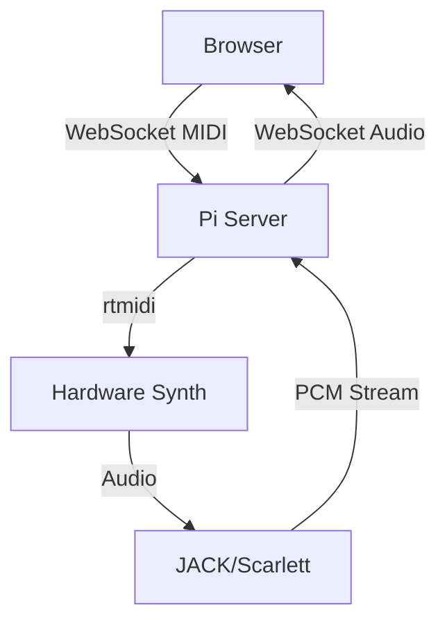

Write out the plan discussed and actions taken to our git repo.

Create the plan file at `docs/plans/$(date +%Y%m%d-%H%M)-$ARGUMENTS.md`

Make sure the plan is clear, actionable, and broken into steps that can be tackled one at a time.

When the plan involves:

- Complex control flow or multi-step sequences
- Data flow between multiple components (Pi server, browser client, audio path)
- System architecture changes
- Network or protocol changes

Include a Mermaid diagram to visualize the flow. Example:

Include sequence diagrams for anything involving the browser-to-Pi-to-hardware chain.

After writing the plan, offer to start implementation.
