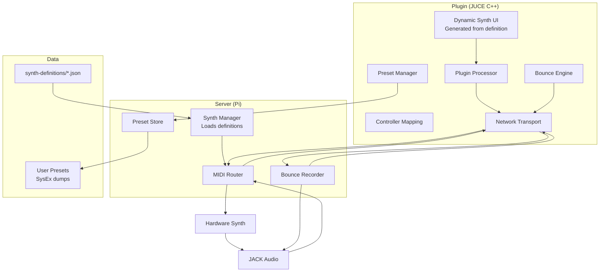
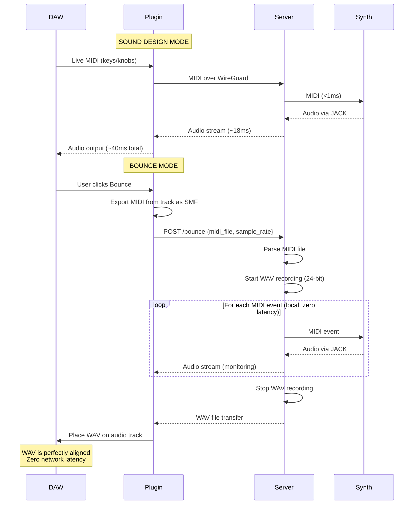

# Implementation Plan: UX Workflow & Synth Definition System

**Status:** Planned
**Date:** 2026-03-30
**Source:** [UX Workflow Spec](20260330-ux-workflow-and-synth-definitions.md)

## Overview

Two major features:
1. **Synth Definition System** — JSON files define every parameter of every synth, driving auto-generated UI, MIDI mapping, and controller profiles
2. **Bounce Workflow** — send a complete MIDI file to the server, it plays locally at zero latency, records lossless WAV, sends it back perfectly aligned

## Architecture



## Bounce Workflow — Sequence



## Implementation Steps

### Step 1: Synth Definition Format + Rev2 Definition

Create the JSON schema and write the complete Prophet Rev2 definition as the reference implementation.

**Files:**
- `synths/schema.json` — JSON Schema for validation
- `synths/sequential-prophet-rev2.json` — complete Rev2 definition (~200 parameters)

**Work:**
- Define the JSON schema with all control types (knob, selector, toggle, display)
- Bootstrap Rev2 parameters from KnobKraft-orm/Edisyn source code
- Include all groups: OSC 1, OSC 2, Mixer, Filter, Filter Env, Amp, Amp Env, LFO 1-4, Mod Matrix, Effects, Sequencer, Global
- Include SysEx config (already proven working in our code)
- Include Launchkey controller profile (already have CC mappings)
- Validate against Rev2 MIDI implementation chart

**Why first:** Everything else depends on having a real definition to work with.

### Step 2: Server — Synth Manager

New module that loads synth definitions and replaces the hard-coded Rev2 config in midi_router.py.

**Files:**
- `server/synth_manager.py` — new: loads definitions, manages parameter state
- `server/midi_router.py` — update: use SynthManager instead of hard-coded SYSEX_OFFSET_TO_CC

**Work:**
- `SynthManager` class: loads JSON definition, validates against schema
- Replaces hard-coded `SYSEX_OFFSET_TO_CC` dict with definition-driven mapping
- SysEx unpacking algorithm selected by definition's `packing` field
- Parameter value scaling (native range → CC 0-127) driven by definition's min/max
- API endpoint: `GET /synth/definition` returns the JSON to the plugin
- API endpoint: `GET /synth/state` returns current parameter values

**Dependencies:** Step 1 (needs a definition to load)

### Step 3: Server — Preset Manager

Save and recall user presets via SysEx dumps.

**Files:**
- `server/preset_manager.py` — new: save/load/list presets
- `server/midi_router.py` — update: add preset API endpoints

**Work:**
- `POST /presets/save` — request edit buffer SysEx from synth, store the dump with user-provided name
- `GET /presets/list` — return list of saved presets for current synth
- `POST /presets/load` — send stored SysEx dump to synth to restore the patch
- Storage: JSON files on disk per-synth (`presets/{synth_id}/{preset_name}.json` with base64 SysEx data)
- Factory preset browsing: bank/program change via definition's `presets` config

**Dependencies:** Step 2 (needs SynthManager for SysEx config)

### Step 4: Plugin — WebView UI with Synth Definition

Replace the current minimal JUCE editor with a WebView rendering the synth panel from the definition.

**Files:**
- `plugin/src/PluginEditor.h/.cpp` — rewrite: WebView-based editor
- `plugin/ui/index.html` — new: the synth panel UI (HTML/CSS/JS)
- `plugin/ui/synth-panel.js` — new: renders controls from definition JSON

**Work:**
- `PluginEditor` hosts a `juce::WebBrowserComponent` filling the plugin window
- On connection, plugin fetches `/synth/definition` from server
- Pass definition JSON to the WebView via JS bridge
- WebView renders parameter groups as sections with appropriate controls:
  - `knob` → canvas-based rotary (reuse existing knob renderer from browser client)
  - `selector` → button group with named values
  - `toggle` → on/off switch
  - `display` → read-only label
- Dynamic labels (FX type changing P1/P2 names) handled via definition's `dynamic_labels`
- JS bridge functions:
  - `window.anarack.sendCC(cc, value)` — send parameter change to server
  - `window.anarack.onCC(cc, value)` — receive parameter update from server
  - `window.anarack.connect(host)` / `disconnect()`
  - `window.anarack.getDefinition()` — get current synth definition
  - `window.anarack.savePreset(name)` / `loadPreset(id)` / `listPresets()`
- Design: Anarack design language (dark theme, indigo accent, consistent with browser client)
- Responsive: works at various plugin window sizes

**Why WebView:** Same UI runs in plugin and browser. One codebase. Arturia, Output, and others use this approach. The audio thread stays in C++ — only the UI is in the WebView.

**Dependencies:** Step 2 (needs definition endpoint on server)

### Step 5: Plugin — MIDI Controller Mapping

Wire hardware MIDI controllers to synth parameters via the definition.

**Files:**
- `plugin/ui/controller-mapping.js` — new: MIDI learn, auto-detect, soft-takeover
- `plugin/ui/synth-panel.js` — update: display mapped controller CC per knob

**Work:**
- Auto-detect connected controller from definition's `controller_profiles`
- Manual MIDI learn: double-click knob in UI → next CC from controller → mapped
- Soft-takeover: track physical knob position, only update parameter when positions cross
- Relative CC handling (already built for Launchkey — extract and generalise)
- Multi-port noise filtering (already built — extract and generalise)
- Store mappings per-synth, per-controller in localStorage (plugin) or server-side

**Dependencies:** Step 4 (needs the WebView UI with knobs to map to)

### Step 6: Server — Bounce Engine

Server-side MIDI file playback and lossless WAV recording.

**Files:**
- `server/bounce_engine.py` — new: MIDI file playback + WAV recording
- `server/midi_router.py` — update: add bounce API endpoint

**Work:**
- `POST /bounce` endpoint accepts:
  - SMF Type 0 MIDI file (binary)
  - Desired sample rate (default 48000)
  - Synth ID
- Bounce engine:
  - Parse MIDI file (use `mido` library)
  - Walk events in chronological order
  - Send each MIDI event to the synth via rtmidi at the correct timestamp
  - Simultaneously record JACK audio to WAV (use `soundfile` library for 24-bit WAV)
  - Stream audio back to plugin for real-time monitoring
- When complete:
  - Return WAV file over the existing network transport
  - Include metadata: duration, sample rate, sample count
- Timing: use `time.perf_counter()` for precise event scheduling (sub-ms accuracy)

**Dependencies:** Steps 2 (SynthManager), existing JACK audio capture

### Step 7: Plugin — Bounce UI + WAV Placement

Plugin-side bounce workflow: trigger, monitor, receive WAV.

**Files:**
- `plugin/ui/bounce.js` — new: bounce UI (button, progress, download)
- `plugin/src/BounceEngine.h/.cpp` — new: MIDI file capture + WAV reception
- `plugin/src/PluginProcessor.cpp` — update: bounce mode in processBlock

**Work:**
- "Bounce" button in the plugin UI
- On click:
  1. Plugin captures MIDI from current DAW track (v1: file dialog to select exported .mid file — DAW MIDI export APIs are non-standard)
  2. Sends MIDI file to server `/bounce` endpoint
  3. Shows progress bar (based on MIDI file duration)
  4. Receives WAV when complete
  5. Saves WAV to disk, opens in Finder / places in DAW project folder
- v1 limitation: WAV auto-placement on DAW timeline is complex (VST3/AU APIs differ). Initial version saves the WAV and the user drags it in. Future version auto-places.
- Download button always available for manual WAV retrieval

**Dependencies:** Step 6 (server bounce engine)

## Implementation Order

```
Step 1: Rev2 Definition JSON          [1 session]
    ↓
Step 2: Server Synth Manager          [1 session]
    ↓
Step 3: Server Preset Manager         [1 session]
    ↓
Step 4: Plugin WebView UI             [2-3 sessions]
    ↓
Step 5: Controller Mapping            [1 session]
    ↓
Step 6: Server Bounce Engine          [1-2 sessions]
    ↓
Step 7: Plugin Bounce UI              [1 session]
```

**Total: ~8-10 sessions**

Steps 1-5 deliver the complete sound design experience.
Steps 6-7 deliver the bounce workflow.

## v1 Scope Boundaries

**In scope:**
- Single synth per session (Rev2 first)
- Full parameter control via auto-generated UI
- MIDI controller mapping (auto-detect + manual learn)
- Preset save/recall (SysEx dumps, personal presets)
- Bounce: MIDI file → lossless WAV (manual MIDI export, manual WAV import)
- Real-time monitoring during bounce

**Out of scope (v1):**
- Multi-synth layering
- Preset marketplace
- DAW automation recording as CC lanes
- Auto MIDI capture from DAW track (use file dialog)
- Auto WAV placement on DAW timeline (user drags in)
- Cloud backup of WAV files
- Multiple take comparison UI

## Risk: DAW MIDI File Access

The biggest v1 compromise: JUCE has no standard API to read MIDI from the current DAW track. The user must:
1. Export their MIDI region as a .mid file from the DAW (Logic: File → Export → MIDI, Ableton: drag clip to desktop)
2. Click Bounce in the plugin, select the .mid file
3. Get the WAV back

This is clunky but functional. The proper solution (auto-capture from DAW transport) requires VST3 extension research and is a v2 feature.
