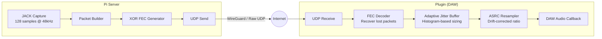
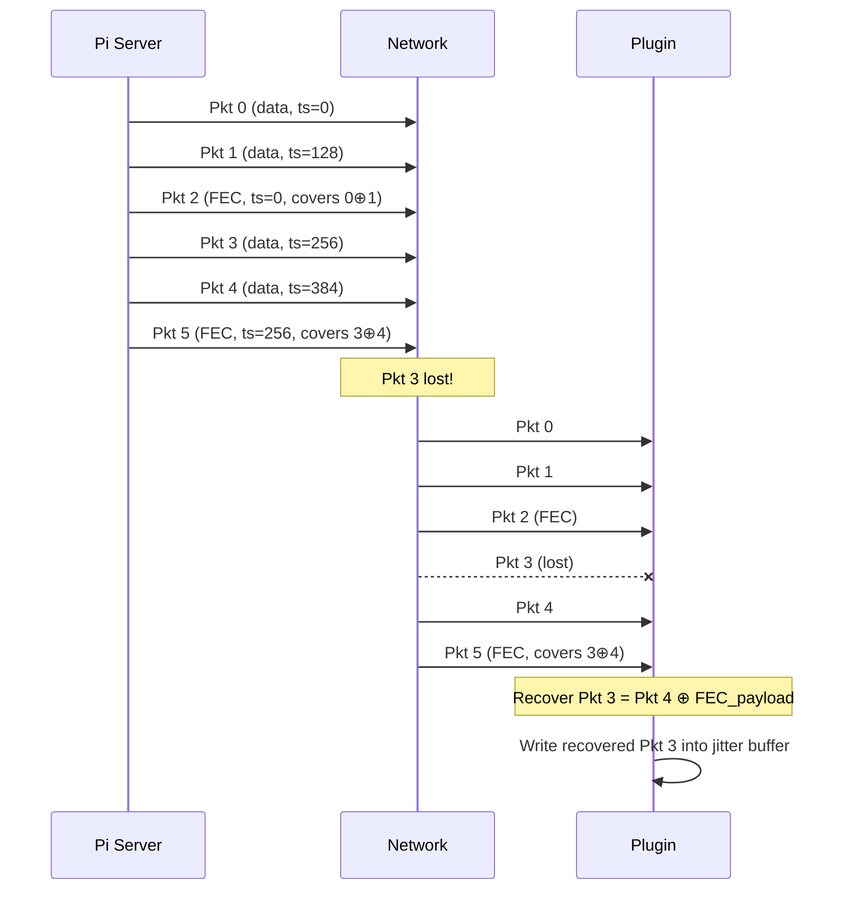
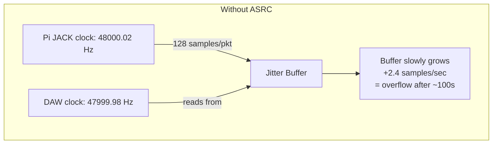
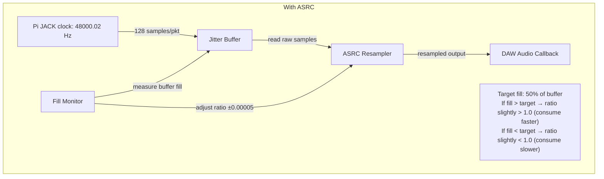
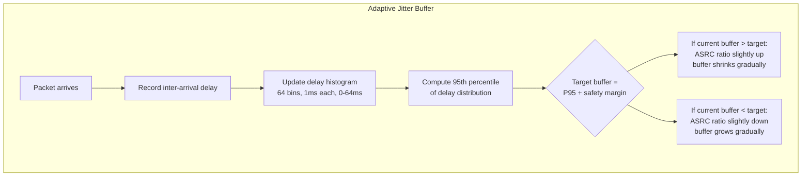

# Audio Streaming Reliability Upgrade

**Goal:** Match WebRTC/Zoom-level audio reliability — adaptive buffering, packet loss recovery, and drift-free clock sync — while keeping the raw PCM pipeline optimized for synth/music audio (not speech).

**Three changes, in implementation order:**
1. XOR-based Forward Error Correction (FEC)
2. Asynchronous Sample Rate Conversion (ASRC) for clock drift
3. Adaptive Jitter Buffer (NetEQ-style)

---

## Architecture Overview



## Current State vs Target

| Aspect | Current | Target |
|--------|---------|--------|
| **FEC** | Crude delayed packet duplication (sends same packet again 5ms later) | XOR parity packets — recover any 1 loss per group of 2 |
| **Jitter buffer** | Fixed size, 50% prebuffer threshold, no adaptation | Histogram-based adaptive sizing, 95th percentile targeting |
| **Clock drift** | None in jitter buffer path (±1 sample in legacy path only) | Continuous ASRC — resampling ratio adjusts based on buffer fill |
| **PLC** | Sample repetition with fade | Unchanged (good enough for synth audio with FEC eliminating most losses) |

---

## Phase 1: XOR Forward Error Correction

**Why first:** Highest impact, lowest risk. Most audible glitches come from packet loss. FEC eliminates ~95% of isolated losses before they reach the jitter buffer.

### Protocol Change

Current packet format (unchanged):
```
[seq:u32] [timestamp:u32] [flags:u16] [checksum:u16] [payload: 128 × int16]
```

New FEC packet (same header format, flag bit 0 set):
```
[seq:u32] [timestamp:u32] [flags:u16 | 0x0001] [checksum:u16] [payload: 128 × int16 XOR]
```

The FEC packet's payload is the XOR of the two preceding data packets' payloads. Its `timestamp` matches the *first* of the two covered packets. Its `seq` is assigned normally (it's a real packet in the sequence).

### Packet Sequence



### Server Changes (`server/midi_router.py`)

In `stream_to_clients()`:

1. Remove the delayed packet duplication (`_dup_ring`, `_dup_delay`, `call_later` logic)
2. Keep a 1-packet buffer of the previous data packet's raw int16 payload
3. After every 2nd data packet, XOR the two payloads byte-by-byte and send an FEC packet with `flags |= 0x0001`
4. FEC packet's `timestamp` = first packet's timestamp, `seq` = next sequence number

```python
# Pseudocode for the FEC send logic
if self._prev_payload is not None:
    # XOR previous and current payload
    fec_payload = bytes(a ^ b for a, b in zip(self._prev_payload, chunk))
    fec_hdr = struct.pack("<IIHh", self._seq, self._prev_ts, 0x0001, 0)
    fec_pkt = fec_hdr + fec_payload
    self._seq += 1
    # Send FEC packet to all UDP clients
    for addr, sock in self.udp_clients.items():
        sock.sendto(fec_pkt, addr)
    self._prev_payload = None
else:
    self._prev_payload = chunk
    self._prev_ts = self._ts
```

**Bandwidth impact:** 50% overhead (3 packets per 2 data packets). Current duplication is 100% overhead, so this is actually *less* bandwidth.

### Plugin Changes

**NetworkTransport receive loop** — add FEC recovery before writing to jitter buffer:

1. Maintain a small ring of the last 8 received data packets (seq → payload mapping)
2. Maintain a small ring of the last 4 FEC packets (covered_timestamp → xor_payload)
3. On receiving a data packet: write to jitter buffer as normal, store in ring
4. On receiving an FEC packet (flag bit 0): store in FEC ring, then check if either of the two covered packets is missing. If so, XOR the FEC payload with the packet we *do* have to recover the missing one, and write it to the jitter buffer
5. Detection of "missing": check if the sequence numbers covered by this FEC group have been seen. The FEC packet's timestamp tells us the first covered packet; the second is at timestamp + 128.

**JitterBuffer.h** — no changes needed. `writePacket()` already handles late arrivals correctly (the `seqDelta < 0 && anyNew` path counts them as `packetsRecovered`).

### Files to Modify

| File | Change |
|------|--------|
| `server/midi_router.py` | Replace dup logic with XOR FEC generation |
| `plugin/src/NetworkTransport.h` | Add FEC recovery ring buffers and structs |
| `plugin/src/NetworkTransport.cpp` | FEC recovery logic in receive loop |

### Testing

- Run on LAN with `tc netem` on the Pi to simulate 5%, 10%, 20% packet loss
- Compare `packetsLost` vs `packetsRecovered` stats before/after
- Listen for glitches on a sustained Rev2 pad at each loss rate

---

## Phase 2: Asynchronous Sample Rate Conversion (ASRC)

**Why second:** Clock drift is the most insidious problem — it's silent for minutes then causes an underrun or overflow. ASRC also solves sample rate conversion (48k→44.1k) in the same mechanism, replacing the disconnected legacy resampler path.

### The Problem



The Pi's JACK clock and the DAW's audio clock are independent crystals. Even at 48kHz↔48kHz, they drift by 10-100 ppm (0.5–5 samples/second). Over a 5-minute session that's 150–1500 samples of accumulated drift. Eventually the buffer overflows or underflows.

### The Solution



### Implementation

**In `PluginProcessor.cpp` `processBlock()`**, replace the direct `jitterBuffer.read(outL, numOutputSamples)` with:

1. **Measure buffer fill** every block (already available via `jitterBuffer.getFillLevel()`)
2. **Compute drift-corrected ratio:**
   ```cpp
   // Base ratio: server rate / DAW rate (e.g., 48000/44100 = 1.0884)
   // Drift correction: nudge ratio based on buffer fill error
   double fillError = (double)(currentFill - targetFill) / (double)targetFill;
   // Smooth the error with a low-pass filter (avoid oscillation)
   smoothedFillError = smoothedFillError * 0.995 + fillError * 0.005;
   // Apply correction: if buffer is overfull, speed up consumption (ratio > base)
   //                    if buffer is underfull, slow down (ratio < base)
   double correctedRatio = baseResampleRatio * (1.0 + smoothedFillError * 0.01);
   // Clamp to avoid runaway: never more than ±500ppm from base
   correctedRatio = juce::jlimit(baseResampleRatio * 0.9995,
                                  baseResampleRatio * 1.0005,
                                  correctedRatio);
   ```
3. **Read from jitter buffer into a temp buffer**, then resample into the output:
   ```cpp
   int inputNeeded = (int)(numOutputSamples * correctedRatio + 2);
   jitterBuffer.read(resampleInputBuf.data(), inputNeeded);
   resampler.process(correctedRatio, resampleInputBuf.data(), outL, numOutputSamples);
   ```

### Key Design Decisions

- **Use the existing `juce::LagrangeInterpolator`** — it's already in the codebase and provides 4th-order interpolation, which is good enough for 16-bit audio. No need for a sinc resampler at ±500ppm correction range.
- **Low-pass filter the fill error** — critical to avoid oscillation. The 0.995/0.005 coefficients give a ~200-block (~500ms) time constant, which is slow enough to avoid audible pitch wobble but fast enough to track drift.
- **Clamp to ±500ppm** — real crystal drift is 10-100ppm. 500ppm ceiling prevents runaway if the network hiccups temporarily skews the fill measurement.
- **Target fill = 50% of buffer** — provides equal headroom for jitter spikes (buffer growing) and stalls (buffer shrinking).
- **This replaces the legacy `AudioRingBuffer` path entirely** — the jitter buffer path becomes the only path, with ASRC always active. When DAW rate = server rate, `baseResampleRatio = 1.0` and the resampler does simple interpolation with only the tiny drift correction.

### Files to Modify

| File | Change |
|------|--------|
| `plugin/src/PluginProcessor.h` | Add `smoothedFillError`, `targetFill` members |
| `plugin/src/PluginProcessor.cpp` | ASRC logic in `processBlock()`, update `prepareToPlay()` |

### Testing

- Run DAW at 44.1kHz, verify no drift over 10+ minutes (monitor buffer fill in UI)
- Run DAW at 48kHz, verify drift correction stays within ±50ppm
- Listen for any pitch wobble on sustained tones — should be completely inaudible at these correction ranges

---

## Phase 3: Adaptive Jitter Buffer

**Why last:** The current fixed buffer works. This is an optimization — lower latency on good networks, better resilience on bad ones. It also depends on ASRC being in place (buffer resizing needs the resampler to absorb the timing changes smoothly).

### How It Works



### Inter-Arrival Delay Tracking

Instead of tracking absolute timestamps (which require clock sync), we track **inter-arrival jitter** — the variation in spacing between consecutive packets:

```
Expected spacing: 128 samples / 48000 Hz = 2.667ms
Actual spacing:   time between consecutive packet arrivals

Jitter = actual_spacing - expected_spacing
```

On a perfect network, jitter = 0. On WiFi, jitter might be 0-5ms with occasional 20ms spikes. On 4G, jitter might be 0-30ms with 50ms spikes.

### Histogram Design

- **64 bins, 1ms each** — covers 0-64ms of jitter, enough for most internet connections
- **Forgetting factor: 0.99 per packet** — each new measurement slightly decays all existing bins. This means the histogram forgets old data with a half-life of ~70 packets (~190ms). Recent network conditions dominate.
- **95th percentile target** — find the bin where 95% of cumulative probability mass lies. This is the minimum buffer depth needed to absorb 95% of jitter.
- **Safety margin: +2 packets (5.3ms)** — on top of the P95 target, to handle the 5% tail without glitching.

### Integration with ASRC

The adaptive buffer doesn't resize by adding/removing samples (which would click on synth audio). Instead, it adjusts the **ASRC target fill level**:

```
targetFill = P95_jitter_samples + safety_margin
```

The ASRC from Phase 2 already chases `targetFill` — so when the adaptive buffer increases `targetFill` (network got worse), the ASRC smoothly slows consumption, growing the buffer. When it decreases `targetFill` (network improved), the ASRC speeds up consumption, shrinking the buffer. No discontinuities, no clicks.

### New Class: `JitterEstimator`

A lightweight class that lives alongside the jitter buffer:

```cpp
class JitterEstimator {
    // Called from network receive thread on each packet arrival
    void recordArrival(uint32_t seq, double arrivalTimeMs);

    // Called from audio thread to get current target buffer depth
    int getTargetBufferSamples() const;

    // Stats for UI
    float getP95JitterMs() const;
    float getCurrentTargetMs() const;

private:
    double lastArrivalMs = 0;
    uint32_t lastSeq = 0;
    float histogram[64] {};       // 64 bins, 1ms each
    float forgetFactor = 0.99f;
    int safetyMarginSamples = 256; // 2 packets
    std::atomic<int> targetBufferSamples { 0 };
};
```

### Files to Create/Modify

| File | Change |
|------|--------|
| `plugin/src/JitterEstimator.h` | **New file** — histogram-based jitter estimator |
| `plugin/src/NetworkTransport.cpp` | Call `jitterEstimator.recordArrival()` on each packet |
| `plugin/src/PluginProcessor.cpp` | Read `jitterEstimator.getTargetBufferSamples()` to set ASRC target |
| `plugin/src/PluginProcessor.h` | Add `JitterEstimator` member |

### Testing

- Monitor P95 jitter and target buffer in the UI
- Test on LAN: target should settle to ~5-10ms (2-4 packets)
- Test over WireGuard: target should settle to ~20-40ms depending on route
- Simulate jitter spikes with `tc netem`: target should ramp up within 200ms, then slowly decay

---

## Implementation Sequence

```mermaid
gantt
    title Implementation Order
    dateFormat X
    axisFormat %s

    section Phase 1 - FEC
    Server XOR FEC generation          :a1, 0, 2
    Plugin FEC recovery in NetworkTransport :a2, 1, 3
    Test with simulated packet loss    :a3, 3, 4

    section Phase 2 - ASRC
    ASRC in processBlock               :b1, 4, 6
    Remove legacy AudioRingBuffer path :b2, 6, 7
    Test drift over 10min sessions     :b3, 7, 8

    section Phase 3 - Adaptive Buffer
    JitterEstimator class              :c1, 8, 10
    Integration with ASRC target       :c2, 10, 11
    Test adaptive behavior             :c3, 11, 12
```



Each phase is independently deployable and testable. Phase 1 (FEC) can ship alone and immediately improve audio quality. Phase 2 (ASRC) fixes the long-session drift problem. Phase 3 (adaptive buffer) is the polish — lower latency on good networks.

---

## Phase 0: Foundation Changes (before FEC/ASRC/Adaptive)

These prerequisite changes address fundamental issues discovered during testing and should be implemented first.

### 0a. Upgrade to 24-bit Audio

**Why:** Testing revealed that the int16 (16-bit) streaming format introduces quantization noise audible on quiet passages. This is the single biggest quality issue — no amount of FEC or buffering can fix it.

**Change:**
- Server: stream `int24` packed as 3 bytes per sample (384 bytes payload instead of 256)
- Plugin: unpack 3-byte samples to float32
- Packet size: 12 (header) + 384 (payload) = 396 bytes. Still well under MTU.

**Impact:** 50% more bandwidth per data packet. With FEC, total ~890 kbps. Still trivial.

### 0b. Continuous Silence Streaming

**Why:** When the Rev2 is silent, no audio packets flow. The jitter buffer drains, ASRC loses its reference, and the first note after silence clips because the buffer needs to re-prebuffer.

**Change:**
- Server: JACK callback always runs (it does), always sends packets. Silent audio = packets full of zeros. Never stop the packet stream.
- This keeps the jitter buffer filled, ASRC stable, and the latency chain intact at all times.

### 0c. Fixed PDC Latency

**Why:** `setLatencySamples()` must be called once at connection time and never change mid-session. The adaptive buffer (Phase 3) changes the effective buffer depth, but the DAW's PDC must remain stable.

**Change:**
- At connection: set `setLatencySamples()` to a **fixed maximum** (e.g., 300ms = the user's buffer setting, or a measured RTT-based ceiling)
- The adaptive buffer can shrink below this (lower actual latency) but never exceed it
- The difference between actual and reported latency = extra safety headroom, which is fine
- Never call `setLatencySamples()` again until disconnect/reconnect

---

## Risks and Mitigations

| Risk | Mitigation |
|------|------------|
| FEC adds 50% bandwidth overhead | Still less than current duplication (100%). At 128-sample packets, total is ~890 kbps with 24-bit — well within WireGuard capacity |
| XOR FEC fails on burst loss (both packets in a pair lost) | Delay the FEC packet by ~5ms (2 packets) so it arrives in a different burst window. If a WiFi stall drops packets 0-3, the FEC for 0⊕1 (sent after packet 3) may also be lost — but the FEC for 2⊕3 (sent after packet 5) survives and recovers packet 2 or 3 |
| FEC packets consume sequence numbers, confusing gap detection | JitterBuffer must treat FEC packets (flag bit 0) as non-audio — don't increment `expectedSeq` for them, don't count them as gaps |
| ASRC ratio oscillation causes audible pitch wobble | Low-pass filter with 500ms time constant + ±500ppm clamp. Inaudible at these ranges |
| ASRC reads variable samples, creating writeBase race condition | The smoothed fill error prevents violent oscillation. Critical: don't start the ASRC filter until the buffer has stabilised (wait for prebuffer to complete, then seed `smoothedFillError = 0`) |
| ASRC resampler runs constantly at ~1.00003, introducing artifacts | At ±500ppm, Lagrange 4th-order interpolation is indistinguishable from source. The `+ 2` padding on inputNeeded means the resampler always has enough context samples |
| Adaptive buffer targets too low, causes underruns | Safety margin of 2 packets. Minimum target floor of 4 packets (~10ms). Fallback: user can still set fixed buffer via UI |
| Adaptive buffer target jumps suddenly, ASRC can't keep up | The 500ms low-pass filter means ASRC takes time to respond. Mitigation: the adaptive target should change slowly too (apply its own low-pass or rate-limit changes to ±1 packet per second) |
| Jitter histogram forgetting factor too aggressive | 0.99 per packet at 375/sec = 190ms half-life. A brief WiFi spike inflates the target, then takes seconds to decay. Consider 0.999 (~2.7s half-life) for less reactive but more stable targeting |
| LagrangeInterpolator quality insufficient for music | At ±500ppm correction, even linear interpolation would be inaudible. Lagrange 4th-order is overkill in a good way |
| Server stops sending during silence | Phase 0b: continuous streaming ensures packets always flow |
| DAW PDC breaks when adaptive buffer changes depth | Phase 0c: PDC set once to fixed maximum, never changes mid-session |

---

## Subtle Issues to Watch

### Latency

- **MIDI-to-audio round trip**: user sends a note → travels to Rev2 via UDP (~RTT/2) → Rev2 produces audio → audio travels back (~RTT/2) → sits in jitter buffer → ASRC → DAW output. Total = RTT + buffer depth. On WireGuard with 80ms RTT and 200ms buffer = **280ms**. PDC compensates during playback but live monitoring has this full latency. Users need to understand: "design sounds with the preview engine (zero latency), record MIDI, play back through hardware (PDC-compensated)."
- **ASRC adds ~0ms latency** — it's a ratio change, not a delay line. The Lagrange interpolator has a few samples of lookahead but this is negligible.
- **Adaptive buffer can INCREASE latency mid-session** if the network degrades. The user won't notice (PDC reported at max) but actual latency grows. This is acceptable — the alternative is glitches.

### Timing / Sync

- **PDC only works during playback**, not live monitoring. When the user plays keys live, they hear the real round-trip latency. This is inherent to remote hardware — no software trick can fix speed-of-light delays.
- **ASRC creates a non-integer sample relationship** between input and output. Over a long session, the cumulative effect is that the plugin outputs a few samples more or fewer than it consumed. This doesn't affect timing (the DAW's clock is the master) but it means the jitter buffer fill level is the true measure of sync, not sample counts.
- **Program changes cause a CC flood** — the Rev2 sends 60+ parameter CCs after loading a new program. These arrive as a burst of UDP packets alongside audio. The FEC/jitter buffer must handle this gracefully — the CC packets are 3 bytes (not 268/396) and should be separated from the audio path before they reach the buffer.

### Pitch / Audio Quality

- **ASRC at ±500ppm = ±0.05% speed change = ±0.0009 semitones**. This is 50x below the threshold of pitch perception (~1 cent = 0.06%). Completely inaudible even on sustained tones.
- **Lagrange interpolation introduces ~-90dB aliasing** at Nyquist. For 48kHz audio with musical content below 20kHz, this is inaudible. If we ever need better: switch to `juce::WindowedSincInterpolator` (already available in JUCE).
- **24-bit quantization floor is -144dBFS** vs int16's -96dBFS. This eliminates the quantization noise that was audible on quiet passages. The Rev2's own noise floor is ~-80dBFS so 24-bit is more than sufficient.
- **FEC recovery reconstructs the exact original packet** (XOR is lossless). Recovered audio is bit-identical to what the server sent. No quality compromise.

### Edge Cases

- **DAW sample rate change mid-session** (user changes from 48k to 44.1k in preferences): `prepareToPlay()` is called again, `baseResampleRatio` updates, ASRC adapts. The jitter buffer doesn't need to know — it always operates at the server's 48kHz. Only the ASRC output rate changes.
- **Network outage > buffer depth**: the buffer drains completely. When packets resume, the jitter buffer re-prebuffers (brief silence) then audio resumes. ASRC smoothly resumes. No clicks, just a gap. The ASRC filter should be reset (`smoothedFillError = 0`) after a re-prebuffer to avoid a stale correction ratio.
- **Very high packet loss (>30%)**: FEC recovers ~50% of single losses. At 30% loss, ~9% of packets have both data packets in a pair lost (unrecoverable). The jitter buffer's PLC handles these with sample repetition + fade. At this loss rate, audio quality degrades gracefully — audible but not catastrophic. The UI should warn the user.
- **Duplicate packets from the old duplication code**: if the server still sends delayed duplicates alongside FEC, the jitter buffer deduplicates them harmlessly. But we should remove duplication to save bandwidth once FEC is proven.
