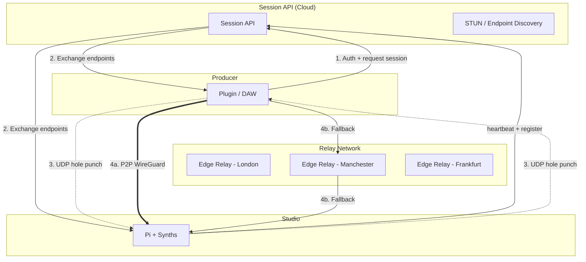
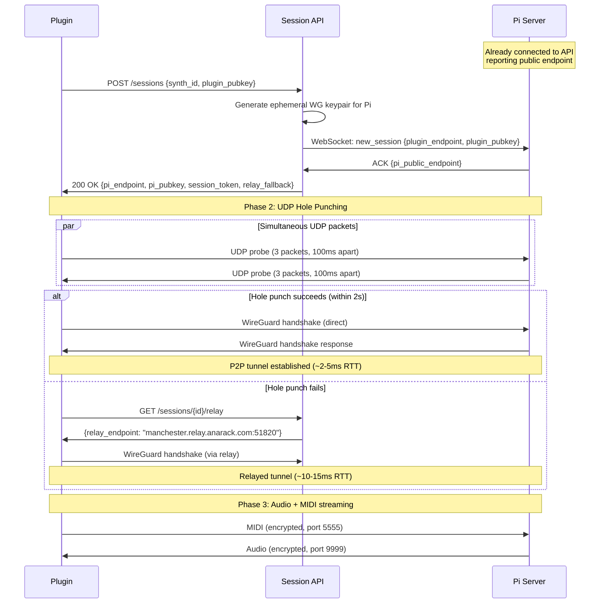
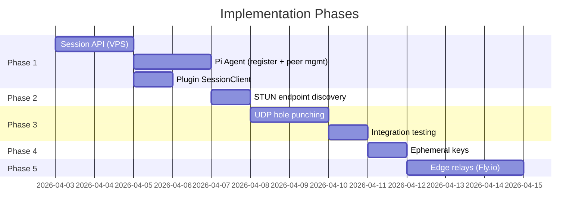

# Plan: P2P NAT Traversal with WireGuard — Eliminate VPS Relay Latency

## Problem

Both the plugin (producer's DAW) and the Pi (synth rack) sit behind NAT routers. Neither has a public IP. Currently all traffic bounces through a VPS relay in Manchester:

```
Plugin (Leeds) ──► VPS (Manchester) ──► Pi (Leeds)
       ~5ms              ~5ms
```

~10ms wasted on a round-trip to Manchester when both endpoints are in the same city. At scale, every session pays this tax unnecessarily.

## Goal

**Try direct P2P first, fall back to relay only if needed.** ~90% of home connections support UDP hole punching. For those users, latency drops from ~18ms to ~2-5ms RTT (same city) or ~10-15ms (cross-country). This makes sub-50ms buffer sizes viable.

## Architecture

### Current vs Target

```
CURRENT:
Plugin ────► VPS relay ────► Pi          (~18ms RTT)

TARGET:
Plugin ◄──────── P2P ────────► Pi        (~2-5ms RTT, 90% of users)
Plugin ────► nearest relay ──► Pi        (~5-15ms RTT, fallback)
```

### System Overview



### Connection Sequence



## Implementation Steps

### Phase 1: Session API

**What:** HTTP/WebSocket API on the VPS that coordinates connections between plugins and Pis.

**Where:** New `server/session_api.py` (or extend `midi_router.py`'s HTTP server)

**Endpoints:**

| Method | Path | Purpose |
|--------|------|---------|
| `POST` | `/sessions` | Plugin requests a session. Sends its public key. Returns Pi endpoint + Pi pubkey + session token. |
| `GET` | `/sessions/{id}/relay` | Get relay endpoint if P2P fails. |
| `DELETE` | `/sessions/{id}` | End session, revoke keys. |
| `WS` | `/pi/register` | Pi maintains persistent WebSocket to API. Reports its public endpoint, available synths, health. |

**Key generation flow:**
1. Plugin calls `WgTunnel::generateKeypair()` (already implemented) to create an ephemeral X25519 keypair
2. Plugin sends its public key to the session API
3. Session API tells the Pi to add the plugin's public key as an allowed peer
4. API returns the Pi's public key + public endpoint to the plugin
5. Plugin connects using its ephemeral private key + Pi's public key

**Pi-side changes:**
- Pi runs a lightweight agent that connects to the session API via WebSocket
- Agent uses `wg set` to dynamically add/remove peers as sessions start/end
- No static WireGuard config needed — peers are managed programmatically

**Files to create/modify:**

| File | Changes |
|------|---------|
| `server/session_api.py` | New — session coordination API |
| `server/pi_agent.py` | New — Pi-side agent that registers with API, manages WG peers |
| `plugin/src/NetworkTransport.cpp` | Replace hardcoded keys with session API fetch |
| `plugin/src/SessionClient.h/cpp` | New — HTTP client for session API |

### Phase 2: STUN-Style Endpoint Discovery

**What:** Discover each side's public IP:port so they can attempt direct connection.

**How:**
1. Plugin sends a UDP packet to the VPS STUN endpoint
2. VPS reads the source IP:port from the UDP packet header (this is the plugin's public endpoint after NAT)
3. VPS returns this info to the plugin
4. Same process for the Pi (or Pi reports its endpoint via the WebSocket)
5. Both sides now know each other's public IP:port

**Implementation:**
- Add a simple STUN-like UDP echo service on the VPS (10 lines of Python)
- Plugin sends a UDP packet, VPS responds with the observed source IP:port
- No need for full RFC 5389 STUN — just need the reflexive address

```python
# Minimal STUN on VPS (server/stun_service.py)
async def stun_handler(sock):
    data, addr = await sock.recvfrom(64)
    # Reply with the sender's public IP:port
    response = json.dumps({"ip": addr[0], "port": addr[1]}).encode()
    sock.sendto(response, addr)
```

**Files to create/modify:**

| File | Changes |
|------|---------|
| `server/stun_service.py` | New — minimal STUN service on VPS |
| `plugin/src/SessionClient.cpp` | Add STUN query before connection |

### Phase 3: UDP Hole Punching

**What:** Both sides send UDP packets to each other's public endpoint simultaneously. This opens NAT pinholes so packets can flow directly.

**How it works:**

```
Plugin NAT                                    Pi NAT
┌──────────┐                              ┌──────────┐
│ Outbound │ Plugin sends to Pi's         │ Outbound │ Pi sends to Plugin's
│ rule     │ public IP:port               │ rule     │ public IP:port
│ created  │ ─────────────────────►       │ created  │ ◄─────────────────
│          │                              │          │
│ Inbound  │ Pi's packets now             │ Inbound  │ Plugin's packets now
│ allowed  │ ◄──── match outbound rule    │ allowed  │ match outbound rule ────►
└──────────┘                              └──────────┘
```

**Sequence:**
1. Session API tells both sides to start hole punching at the same time
2. Both sides send 3 UDP probe packets, 100ms apart, to the other's public endpoint
3. If either side receives a probe, hole punch succeeded
4. Start WireGuard handshake over the direct path
5. If no response within 2 seconds, fall back to relay

**NAT types and success rates:**

| Plugin NAT | Pi NAT | P2P possible? |
|------------|--------|---------------|
| Full cone | Any | Yes (easy) |
| Restricted cone | Full/Restricted cone | Yes |
| Port-restricted | Port-restricted | Yes (with simultaneous open) |
| Symmetric | Symmetric | No — use relay |
| Symmetric | Any other | Sometimes (port prediction) |

~90% of home routers are full/restricted/port-restricted cone. Symmetric NAT is mainly enterprise firewalls.

**Plugin-side implementation:**
```cpp
// In SessionClient or NetworkTransport
bool tryHolePunch(const String& remoteIp, int remotePort, int localFd, int timeoutMs = 2000)
{
    // Send 3 probe packets
    for (int i = 0; i < 3; ++i)
    {
        uint8_t probe[] = { 0xAA, 0x55 }; // magic bytes
        sendto(localFd, probe, 2, 0, remoteAddr, sizeof(remoteAddr));
        Thread::sleep(100);
    }

    // Wait for response
    auto start = Time::getMillisecondCounter();
    while (Time::getMillisecondCounter() - start < timeoutMs)
    {
        uint8_t buf[64];
        int n = recvfrom(localFd, buf, 64, MSG_DONTWAIT, ...);
        if (n > 0) return true; // got a response — hole punch worked
        Thread::sleep(10);
    }
    return false; // timeout — fall back to relay
}
```

**Files to modify:**

| File | Changes |
|------|---------|
| `plugin/src/NetworkTransport.cpp` | Add hole punch attempt before WireGuard connect |
| `server/pi_agent.py` | Pi-side hole punch (send probes when session starts) |

### Phase 4: Ephemeral Keys + Multi-Session

**What:** Replace the hardcoded static WireGuard keypair with per-session ephemeral keys.

**Current (hardcoded in NetworkTransport.cpp:95-97):**
```cpp
// TODO: ephemeral keys via session API. For now, use static test keypair.
auto privKey = juce::String("XTmhMhpKGEhfNtqff4GUQ5cS281pfScf+1x2Cd6aF44=");
auto pubKey = juce::String("arRpxSMBrlWstnbjoHA5sL6ONaVHIeH5pcWAhZPsXEM=");
```

**Target:**
```cpp
// Plugin generates fresh keypair each session
auto [privKey, pubKey] = WgTunnel::generateKeypair(); // already implemented!
// Send pubKey to session API, get Pi's pubKey back
auto session = sessionClient.createSession(pubKey);
// Connect using ephemeral keys
wgTunnel->connect(privKey, session.piPubkey, session.piEndpoint, ...);
```

**Pi-side:**
- Pi agent receives plugin's pubkey via WebSocket
- Runs `wg set wg0 peer <plugin_pubkey> allowed-ips 10.0.0.3/32` to add the peer
- On session end: `wg set wg0 peer <plugin_pubkey> remove`

**Benefits:**
- Each session has unique keys — no key reuse across users
- Pi can serve multiple concurrent users (different tunnel IPs per session)
- Keys are revoked when sessions end — no lingering access

### Phase 5: Edge Relays (Scale)

**What:** Deploy WireGuard relay nodes in multiple locations so the fallback path is always fast.

**When:** When you have users outside your local area, or multiple Pi locations.

**How:**
- Deploy lightweight relay instances on Fly.io (global edge, ~$5/month per location)
- Each relay runs WireGuard and forwards encrypted UDP
- Session API picks the nearest relay to the user based on latency probes or GeoIP
- Plugin tries P2P first, falls back to nearest relay

**Locations (UK-focused start):**
- London
- Manchester (existing VPS)
- Dublin

**Later (European expansion):**
- Amsterdam, Frankfurt, Paris

This is a later-stage optimization. The existing Manchester VPS works as the single relay for now.

## Implementation Order



**Phase 1** is the foundation — everything else builds on it. Phases 2+3 are the latency win. Phase 4 is security. Phase 5 is scale.

## Risk Mitigation

| Risk | Impact | Mitigation |
|------|--------|------------|
| Hole punching fails (symmetric NAT) | User gets relay latency | Automatic fallback to relay — same as current. User never notices. |
| Session API goes down | No new connections | Pi falls back to static keypair mode (current behaviour). Existing sessions unaffected. |
| Pi's public IP changes (dynamic IP) | Stale endpoint in API | Pi agent sends heartbeat with current endpoint every 30s. API always has fresh data. |
| Multiple users on same Pi | Port conflicts | Each session gets unique tunnel IP (10.0.0.3, 10.0.0.4, etc.) and unique port mapping. |
| ISP blocks UDP | No connection at all | Extremely rare for home ISPs. Could add TCP fallback via WebSocket tunnel as last resort. |

## Latency Budget (Target)

| Component | Current | After P2P | Notes |
|-----------|---------|-----------|-------|
| Network RTT | ~18ms | ~2-5ms | Same city, P2P |
| WireGuard encrypt/decrypt | ~1ms | ~1ms | Same |
| JACK buffer (Pi) | 2.7ms | 2.7ms | 64 samples @ 48kHz |
| Plugin buffer | 80ms | 30-50ms | Reduced — P2P is more stable |
| DAW buffer | 0.7ms | 0.7ms | 32 samples @ 48kHz |
| **Total** | **~102ms** | **~37-59ms** | **42-64% reduction** |

At ~40ms total latency, producers can play the synth as naturally as if it were on a desk in front of them.

## What We Keep

- **boringtun** stays as the embedded WireGuard implementation — no new dependencies
- **VPS** stays as the session API host + fallback relay — no new infrastructure
- **Raw UDP mode** stays for LAN testing — unchanged
- **Packet format** unchanged — headers, duplication, ASRC all stay as-is
- **`WgTunnel::generateKeypair()`** already implemented — just needs to be called

## Files Summary

| File | Status | Purpose |
|------|--------|---------|
| `server/session_api.py` | **New** | Session coordination, STUN, endpoint exchange |
| `server/pi_agent.py` | **New** | Pi registers with API, manages WG peers, hole punches |
| `plugin/src/SessionClient.h/cpp` | **New** | Plugin HTTP client for session API |
| `plugin/src/NetworkTransport.cpp` | **Modify** | Use session API + hole punch before connecting |
| `plugin/src/WgTunnel.cpp` | **Modify** | Minor — accept dynamic endpoints |
| `plugin/src/PluginEditor.cpp` | **Modify** | Connection UI shows P2P vs relay status |
