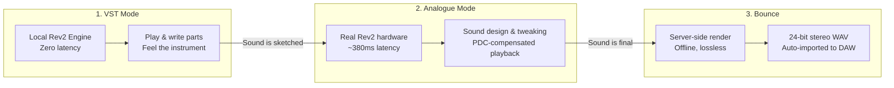
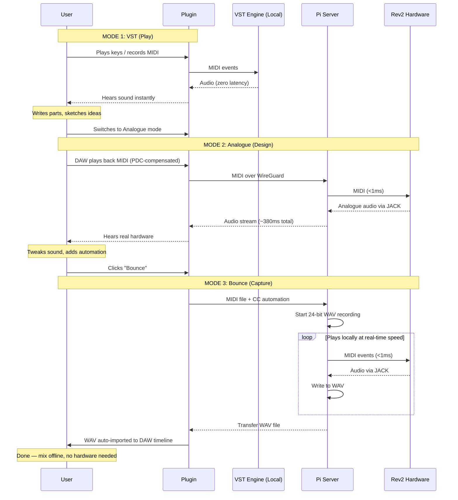
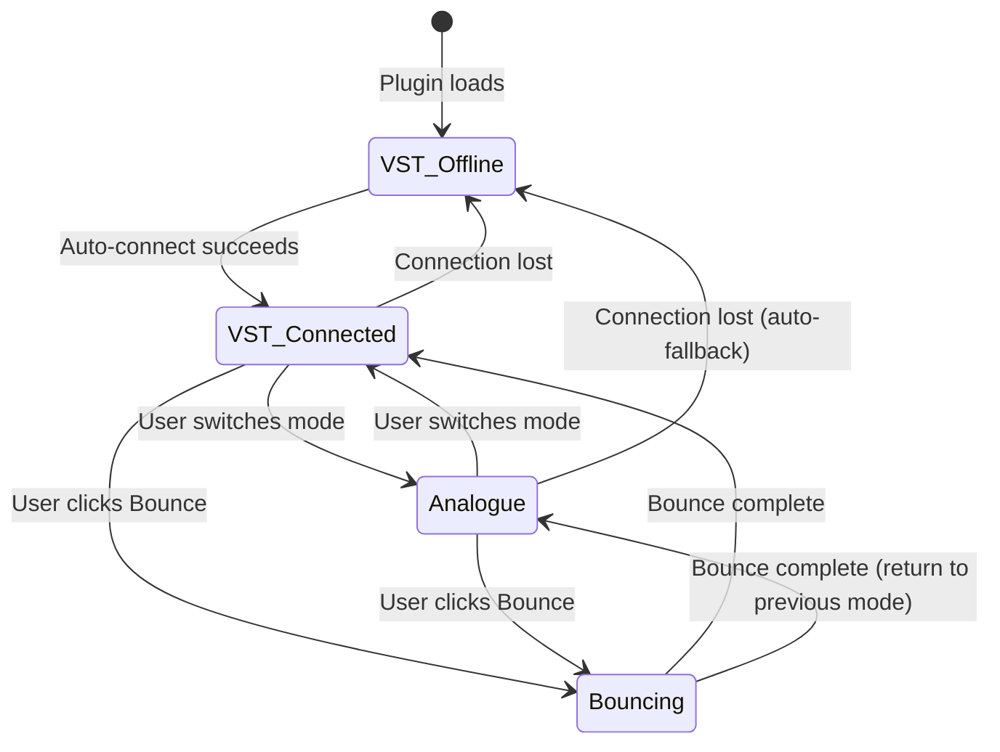
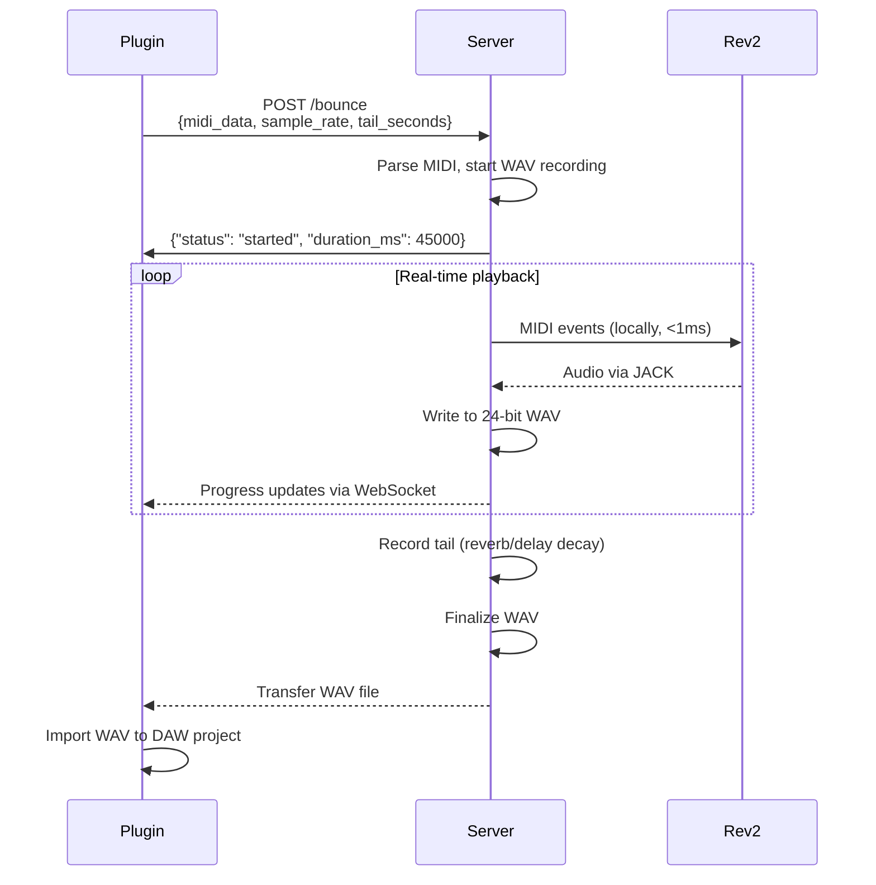
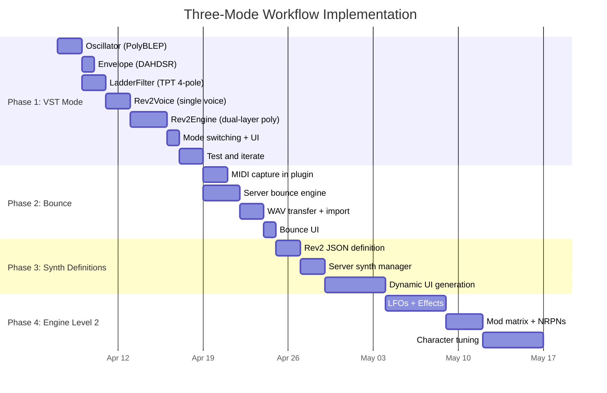

# Three-Mode Workflow: VST → Analogue → Bounce

**Status:** Planned
**Date:** 2026-04-03
**Supersedes:**
- `rev2-preview-engine.md` (Rev2 modelling detail — still valid, incorporated as Phase 2 below)
- `20260330-ux-workflow-and-synth-definitions.md` (two-phase workflow — evolved to three modes)
- `20260330-implementation-ux-workflow-synth-definitions.md` (implementation steps — replaced by this plan)
- `20260401-2002-audio-streaming-reliability.md` (FEC/ASRC/adaptive buffer — streaming solved separately, ASRC retained)

## The Problem

Anarack requires a ~300ms buffer for stable internet audio. Total MIDI-to-audio latency is ~380ms over WireGuard. This makes live keyboard playing unusable — anything over ~10ms feels sluggish, 380ms is impossible to perform with.

But most producers don't play synths live into a final take. They design sounds, sketch parts, then render. The workflow should be designed so latency is **irrelevant**, not merely tolerated.

## The Solution: Three Explicit Modes



### Mode 1: VST (Play)

**Purpose:** Write your parts with zero latency. Get the feel of the instrument.

- Local DSP engine modelling the Rev2's signal path
- Same knobs, same CCs, same parameter ranges as the real thing
- Responds to the same MIDI — play your controller, hear instantly
- Sound is "close enough" to write with, not a perfect replica
- **No network connection required** — works offline, on a train, anywhere
- This is where notes go down and the musical idea takes shape

**What the user does:** Opens the plugin, picks a preset, plays. Records MIDI into the DAW. Tweaks the sound broadly. Doesn't worry about "is this exactly what the hardware sounds like."

### Mode 2: Analogue (Design)

**Purpose:** Hear the real hardware. Design the final sound.

- Audio streams from the real Rev2 via WireGuard
- 380ms latency doesn't matter — you're listening and tweaking, not performing
- DAW playback is PDC-compensated — MIDI plays back in sync
- The analogue character, the filter warmth, the oscillator drift — this is what you can't model
- Automate CC sweeps, dial in the exact patch

**What the user does:** Switches to Analogue mode. Hears their MIDI part through the real Rev2. Tweaks filter, envelopes, effects until it sounds right. Records CC automation. A/B's with the VST to hear the difference.

### Mode 3: Bounce (Capture)

**Purpose:** Render the final part as studio-quality audio.

- User clicks "Bounce"
- Plugin sends the complete MIDI + CC automation to the Pi server
- Server plays MIDI locally into the Rev2 at real-time speed (zero network latency)
- Scarlett captures lossless 24-bit stereo
- WAV transferred back to plugin and auto-imported into the DAW
- User doesn't need to sit through it — work on another part while it renders
- The WAV is perfectly timed, bit-perfect, studio quality

**What the user does:** Hits Bounce, waits (or works on something else), gets a notification, the WAV appears on their timeline.

## User Journey



## Mode Switching UX

Mode switching must be **explicit and obvious**. The user should never be confused about what they're hearing.

```
┌─────────────────────────────────────────────────────┐
│  [🎹 VST]    [🔊 Analogue]              [⏺ Bounce] │
│   ●                                                 │
│  Playing through local engine                       │
└─────────────────────────────────────────────────────┘
```

- **VST** and **Analogue** are radio buttons — one or the other, never both
- **Bounce** is a separate action button — it's a process, not a mode
- Clear visual feedback: different background colour per mode
- Status text: "Playing through local engine" / "Streaming from Rev2" / "Bouncing... 45%"
- VST mode available even when disconnected (offline use case)
- Analogue mode requires active connection — greyed out if offline
- Switching VST → Analogue: seamless if connected, shows "Connect first" if not
- Switching Analogue → VST: instant, no network dependency

### Connection State vs Mode



- Plugin always starts in **VST mode** — instant audio, no waiting for connection
- Auto-connect happens in background — Analogue becomes available when connected
- If connection drops while in Analogue mode → auto-fallback to VST with a notification
- Bounce requires connection — button disabled/greyed when offline

## Architecture

### What Exists Today

| Component | Status | Notes |
|-----------|--------|-------|
| JUCE plugin with AU/VST3 | ✅ Built | Mono output, WebView UI |
| NetworkTransport (WireGuard + raw UDP) | ✅ Built | P2P + relay + LAN modes |
| JitterBuffer with PLC | ✅ Built | Timestamp-indexed, crossfade concealment |
| ASRC drift correction | ✅ Built | Continuous ratio adjustment, click-free |
| Rev2 front panel UI (HTML) | ✅ Built | Hand-coded for Rev2 specifically |
| MIDI learn + controller mapping | ✅ Built | LaunchKey support, relative encoders |
| DAW automation via parameters | ✅ Built | CCs exposed as AudioParameterFloat |
| Bidirectional MIDI (Rev2 → plugin) | ✅ Built | CC broadcast + patch names |
| Session API + Pi Agent | ✅ Built | P2P connection coordination |

### What Needs Building

| Component | Complexity | Phase |
|-----------|-----------|-------|
| Rev2 VA engine (Level 1 — "write with it") | Medium | Phase 1 |
| Mode switching in PluginProcessor | Small | Phase 1 |
| Mode switching UI | Small | Phase 1 |
| Server-side bounce engine | Medium | Phase 2 |
| MIDI file export from plugin | Medium | Phase 2 |
| WAV transfer + DAW import | Medium | Phase 2 |
| Synth definition JSON system | Medium | Phase 3 |
| Auto-generated UI from definitions | Large | Phase 3 |
| Rev2 VA engine Level 2 (accurate character) | Large | Phase 4 |

## Phase 1: VST Mode + Mode Switching

**Goal:** Play and write parts with zero latency using a local Rev2-like synth engine.

### 1.1 Rev2 Engine — Level 1 ("Good Enough to Write With")

Not trying to be indistinguishable from the hardware. Trying to be a polysynth that:
- Has the same controls (same CCs do the same things)
- Responds to the same MIDI
- Sounds like "a good polysynth" — correct oscillator shapes, resonant filter, ADSR envelopes
- Lets you write parts that translate meaningfully when you switch to Analogue mode

**Signal path per voice:**

```
OSC1 (PolyBLEP: saw/tri/pulse) ─┐
                                  ├─► Mixer (balance + sub + noise)
OSC2 (PolyBLEP: saw/tri/pulse) ─┘           │
                                             ▼
                                     4-pole LPF (TPT ladder)
                                             │
                                       Filter Env ──► cutoff mod
                                             │
                                            VCA
                                             │
                                        Amp Env ──► amplitude
                                             │
                                          Output
```

**Dual layer architecture:**
- Layer A (8 voices) + Layer B (8 voices) — Rev2's stacked mode is fundamental to its sound
- Layer modes: Stacked (both on every note), Split (keyboard zones), Layer A only
- Voice allocation: round-robin with voice stealing (oldest note)

**Components (from rev2-preview-engine.md, still valid):**

| Component | File | Description |
|-----------|------|-------------|
| Oscillator | `plugin/src/engine/Oscillator.h/.cpp` | PolyBLEP saw, tri, pulse. PWM. Sync. |
| LadderFilter | `plugin/src/engine/LadderFilter.h/.cpp` | TPT 4-pole LPF, resonance, saturation |
| Envelope | `plugin/src/engine/Envelope.h/.cpp` | DAHDSR with velocity scaling |
| Rev2Voice | `plugin/src/engine/Rev2Voice.h/.cpp` | One voice: 2 oscs → mixer → filter → VCA |
| Rev2Engine | `plugin/src/engine/Rev2Engine.h/.cpp` | Dual-layer polyphony, voice allocation, stereo sum |
| Parameter bridge | integrated | `Rev2Engine::setCC(cc, value)` reads from existing `ccValues[128]` |

**Implementation order:**
1. Oscillator — PolyBLEP saw/pulse/tri, test standalone
2. Envelope — ADSR with delay, velocity
3. LadderFilter — TPT 4-pole
4. Rev2Voice — wire up: oscs → mixer → filter → VCA
5. Rev2Engine — dual-layer polyphony, voice management
6. Wire into PluginProcessor — mode toggle

**What we're NOT doing in Level 1:**
- Effects (delay, chorus, reverb) — Phase 4
- LFOs — Phase 4 (envelopes are enough to write with)
- Mod matrix — Phase 4
- Aux envelope routing — Phase 4
- Oscillator slop / analogue character — Phase 4
- SysEx preset import — Phase 2 (useful but not blocking)

### 1.2 Mode Switching in PluginProcessor

```cpp
enum class PlayMode { VST, Analogue };
std::atomic<int> playMode { (int)PlayMode::VST };

// In processBlock:
if (playMode == PlayMode::VST)
{
    // Feed MIDI to local engine, render audio
    previewEngine.processBlock(buffer, midiEvents, numOutputSamples);
    // Optionally still send CCs to hardware (keeps it in sync for when they switch)
}
else // Analogue
{
    // Existing network audio path (JitterBuffer → ASRC → output)
    ...
}
```

**Key decision:** When in VST mode, still forward CCs to the hardware (if connected). This means when the user switches to Analogue, the Rev2 is already set to roughly the right patch. The sounds won't match perfectly (Level 1 model) but the knob positions will be correct.

### 1.3 Mode Switching UI

Add to the status bar in `rev2-panel.html`:

```html
<div class="mode-switch">
  <button class="mode-btn active" id="mode-vst">VST</button>
  <button class="mode-btn" id="mode-analogue">Analogue</button>
</div>
```

- VST button always enabled
- Analogue button greyed out when disconnected, enabled when connected
- Active mode highlighted
- Switching sends event to C++ via JS bridge → `processor.playMode.store(...)`

## Phase 2: Bounce (Offline Render)

**Goal:** Render the final part as lossless stereo audio, auto-imported to the DAW.

### 2.1 Server-Side Bounce Engine



**Server changes (`server/bounce_engine.py`):**

- `POST /bounce` endpoint accepts MIDI data (SMF Type 0 binary) + config
- Parse MIDI events using `mido` library
- Send each MIDI event to Rev2 at correct timestamp via rtmidi
- Record JACK audio to 24-bit stereo WAV via `soundfile`
- Configurable tail time (record extra seconds for reverb/delay decay)
- Progress updates via WebSocket
- When done, transfer WAV back over WireGuard

**Timing precision:**
- Use `time.perf_counter()` for event scheduling
- Events scheduled relative to recording start
- JACK callback provides sample-accurate recording — timing is inherent

### 2.2 Plugin-Side Bounce

**Getting the MIDI:**

This is the trickiest part. JUCE has no standard API to read MIDI from the current DAW track.

Options (in order of user-friendliness):
1. **Record MIDI passthrough** — plugin is already on the track, MIDI flows through `processBlock`. Record all MIDI events during DAW playback into a buffer. User plays the region once → plugin captures the MIDI → ready to bounce.
2. **File dialog** — user exports .mid from DAW, selects it in the plugin. Clunky but works everywhere.
3. **Clipboard/drag** — user drags MIDI region from DAW onto the plugin. DAW-dependent.

**Recommendation: Option 1 for v1.** The plugin is already receiving all MIDI in processBlock. Add a "Capture" button:
1. User clicks Capture, starts DAW playback
2. Plugin records all MIDI events (notes + CCs) with sample-accurate timestamps
3. Playback reaches the end of the region, user clicks Stop Capture (or it auto-stops when MIDI goes silent for N seconds)
4. Plugin has the complete MIDI data — ready to bounce
5. User clicks Bounce → MIDI sent to server → WAV comes back

This avoids the file export dance entirely.

**WAV import:**

- Plugin receives WAV data over network transport
- Saves to DAW project folder (JUCE can detect this from `getStateInformation` context or use a configurable path)
- For auto-import to DAW timeline: no universal API exists across AU/VST3. v1 approach:
  - Save WAV to a known location
  - Show notification: "Bounce complete — WAV saved to [path]"
  - User drags into DAW (one action)
- v2: investigate Logic's AU hosting API and Ableton's ARA extension for auto-placement

### 2.3 Bounce UI

```
┌──────────────────────────────────────────┐
│  ⏺ Bounce                                │
│                                          │
│  [📝 Capture MIDI]  [⏺ Bounce to Audio]  │
│                                          │
│  Status: Ready — 47 bars captured        │
│  ████████████░░░░  67%  1:23 remaining   │
└──────────────────────────────────────────┘
```

- **Capture MIDI** button: arms recording, captures MIDI during DAW playback
- **Bounce to Audio** button: sends captured MIDI to server, starts render
- Progress bar with time remaining
- Cancel button
- When done: "WAV saved to ~/Music/Anarack/bounces/Rev2-2026-04-03-15-30.wav"

## Phase 3: Synth Definition System

**Goal:** Make Anarack work with any synth, not just the Rev2.

This phase replaces the hard-coded Rev2 parameter list with a data-driven system. The existing plans (`20260330-ux-workflow-and-synth-definitions.md`) have the JSON schema and implementation steps already worked out. Key points:

- JSON files define every parameter, CC mapping, SysEx format, and UI layout per synth
- Server loads the definition → drives MIDI routing and SysEx parsing
- Plugin fetches the definition → generates UI dynamically
- The Rev2 is the first (and for now, only) definition
- Future synths: Moog Subsequent 37, Korg Prologue, etc.

**This phase also includes:**
- SysEx preset import/export (load hardware patches into the VST engine)
- Preset browser (factory banks + user presets)
- Controller profiles per synth

See `20260330-ux-workflow-and-synth-definitions.md` for the full spec — it remains valid.

## Phase 4: Rev2 Engine Level 2 (Character)

**Goal:** Make the VST model sound recognisably Rev2-like, not just "a polysynth."

This is the open-ended "make it sound better" phase:
- LFOs (4 per voice, multi-shape, routable)
- Effects (delay, chorus, phaser, distortion, reverb)
- Aux envelope with destination routing
- Mod matrix (8 slots, source → destination → amount)
- Oscillator slop (random pitch drift per voice)
- Filter character tuning (nonlinearity, saturation curves)
- Envelope curve tuning (match Rev2's exponential shapes)
- A/B testing against hardware recordings

See `rev2-preview-engine.md` Phases 2-4 for detail — still valid.

## Implementation Sequence



## Risks

| Risk | Impact | Mitigation |
|------|--------|------------|
| Level 1 engine sounds too different from Rev2 — users confused when switching to Analogue | High | Set expectations clearly in UI: "VST preview — switch to Analogue for the real sound." The VST is a writing tool, not a replacement. |
| MIDI capture misses events or timestamps are wrong | Medium | Use processBlock sample positions (sample-accurate). Record CC automation alongside notes. Test with complex sequences. |
| Bounce WAV timing offset — WAV doesn't align to DAW timeline | High | Include the exact MIDI start time in the bounce metadata. Plugin compensates when placing the WAV. Test with click track. |
| Server bounce blocks audio streaming (JACK can't do both) | Medium | JACK can route to multiple clients. Bounce engine registers a separate JACK client for recording while midi_router continues streaming. |
| Rev2 responds differently to rapid MIDI in bounce vs real-time | Low | Unlikely — MIDI is played at exactly real-time speed. But test with dense CC automation. |
| WAV file transfer over WireGuard is slow for long bounces | Medium | A 5-minute 24-bit stereo WAV is ~50MB. At ~10Mbps over WireGuard, that's ~40 seconds. Acceptable. Show progress bar. For very long tracks, consider FLAC compression before transfer. |
| Level 1 engine too CPU-heavy for 16 voices × 2 layers | Low | PolyBLEP + TPT filter is lightweight. Budget ~5% CPU on Apple Silicon. Monitor and optimize if needed. |

## What This Means for the Product

Anarack isn't "play a remote synth with latency." It's:

**"Analogue sound design and rendering as a service, with a pro workflow."**

The three modes map to how producers actually work:
1. **VST** — "I'm writing." Fast, responsive, offline-capable.
2. **Analogue** — "I'm designing the sound." Real hardware, real character.
3. **Bounce** — "I'm done, give me the audio." Studio quality, perfectly timed.

The latency isn't a limitation — it's irrelevant, because the workflow never requires real-time.
