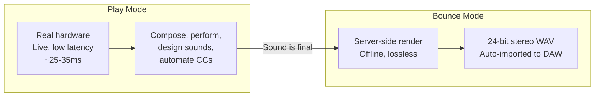
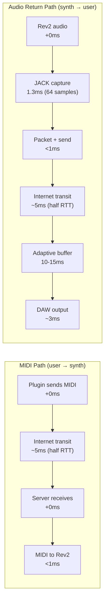
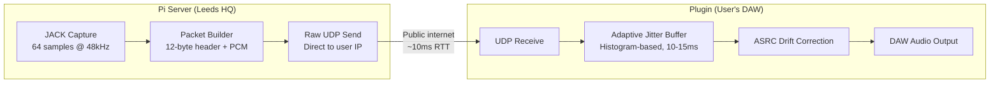
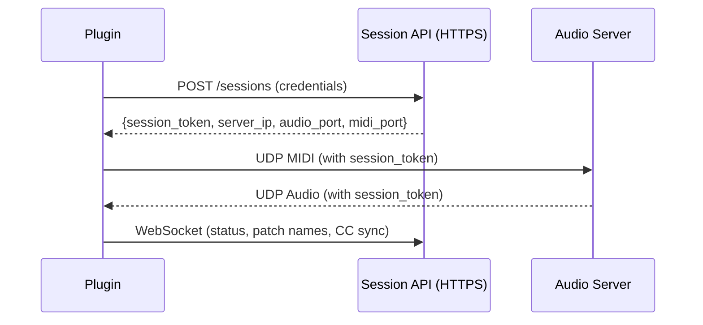
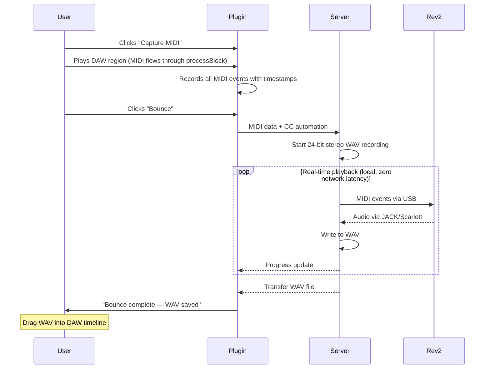

# Revised Product Strategy: Live Analogue + Bounce

**Status:** Active — this is the current strategy
**Date:** 2026-04-03
**Supersedes:**
- `20260403-1514-three-mode-workflow.md` (three modes → two modes, synth modelling dropped)
- `20260401-2002-audio-streaming-reliability.md` (FEC dropped, adaptive buffer retained)
- `rev2-preview-engine.md` (synth modelling dropped entirely)

## Core Insight

A Raspberry Pi on a leased line in a UK data centre or office gives **5-15ms RTT** to most UK users. With an adaptive jitter buffer and raw UDP (no WireGuard on the audio path), total MIDI-to-audio latency can be **25-35ms**. That's a live playable instrument — comparable to a guitarist playing through a USB audio interface.

**This means synth modelling is unnecessary.** The real hardware IS the product. The latency is low enough to play live. No compromise, no "close enough" emulation.

## The Product

Anarack is a remote hardware synth studio. Producers connect from their DAW, play real analogue synths over the internet with near-zero latency, and bounce lossless stereo recordings.

### Two Modes



**Play** — real hardware, live audio, lowest achievable latency. This is where you write parts, design sounds, perform, automate. It feels like the synth is in your room.

**Bounce** — offline render. Server plays your MIDI locally into the synth, captures lossless 24-bit stereo, sends the WAV back. Perfectly timed, studio quality. For final mixdown.

No synth modelling. No "preview" mode. No compromise. Just the real thing.

## Why This Works Now (And Didn't Before)

The original architecture used WireGuard (boringtun) through a VPS relay for NAT traversal. This added ~150-200ms of latency:

| Factor | Old (home Pi + VPS relay) | New (office/colo + leased line) |
|--------|--------------------------|--------------------------------|
| NAT traversal | VPS relay needed (no public IP) | Direct connection (static IP) |
| Encryption | boringtun userspace (+50ms jitter) | Raw UDP for audio (0ms overhead) |
| Network path | Plugin → VPS → Pi (2 hops) | Plugin → server (1 hop) |
| Network stability | Home broadband (variable jitter) | Leased line (stable, low jitter) |
| Jitter buffer | Fixed 300ms (conservative) | Adaptive 10-15ms (histogram-based) |
| **Total latency** | **~350-400ms** | **~25-35ms** |

The data centre deployment eliminates every source of unnecessary latency. What remains is physics: speed of light + JACK capture + a small adaptive buffer.

## Latency Budget

Target: **sub-35ms** for UK users connecting to Leeds HQ.



| Step | Latency | Notes |
|------|---------|-------|
| MIDI: plugin → server | ~5ms | Half RTT on leased line |
| MIDI: server → Rev2 | <1ms | Local USB MIDI |
| Rev2 produces sound | 0ms | Analogue, instant |
| JACK captures audio | 1.3ms | 64 samples @ 48kHz |
| Audio: server → plugin | ~5ms | Half RTT |
| Adaptive jitter buffer | 10-15ms | Histogram-based, targets P95 jitter |
| DAW output buffer | ~3ms | 128 samples @ 44.1kHz |
| **Total** | **~25-30ms** | |

For comparison:
- Acoustic piano: ~3ms (hammer to ear)
- Guitar through USB interface: ~10-20ms
- Guitarist 10m from amp: ~30ms
- **Anarack UK user: ~25-35ms** ← right in the "feels live" range

## Streaming Architecture (Revised)

### Audio Path: Raw UDP, No Encryption



**No WireGuard on the audio path.** Audio is int16/int24 PCM — there's nothing sensitive in it. A leaked packet is a millisecond of synth audio. Not worth adding 50ms of jitter to protect.

**Authentication:** Each session gets a random token. Plugin includes the token in every UDP packet header. Server drops packets with invalid tokens. This prevents unauthorized access without any encryption overhead.

**Control channel stays secure:** Session management, login, billing, MIDI — all over HTTPS/WSS. Only the high-frequency audio stream is raw UDP.

### Control Path: HTTPS + WebSocket



### Adaptive Jitter Buffer

Replace the fixed buffer with a NetEQ-style histogram approach:

1. **Track inter-arrival jitter** — measure the variation in packet arrival times
2. **Maintain a histogram** — 64 bins, 1ms each, with a forgetting factor
3. **Target the 95th percentile** — buffer just enough to absorb 95% of jitter
4. **Resize via ASRC** — adjust the resampling ratio to smoothly grow/shrink the buffer. No clicks, no discontinuities.

On a leased line with ~2ms jitter, the buffer naturally settles to 10-15ms.
On home broadband with ~10ms jitter, it settles to 20-30ms.
On mobile/poor connections, it grows to whatever's needed.

**The user sees their actual latency** in the plugin UI. No hiding, no guessing. "Round trip: 28ms" — they know exactly what they're getting.

### JACK at 64 Samples

Reduce the Pi's JACK buffer from 128 to 64 samples:
- 128 samples @ 48kHz = 2.67ms capture latency
- 64 samples @ 48kHz = 1.33ms capture latency
- Saves 1.3ms — meaningful when every ms counts
- Pi 5 handles this easily on a dedicated audio machine

## Bounce Workflow

Unchanged from the previous plan. Server-side offline render.



**MIDI capture via processBlock** — the plugin is already on the track receiving MIDI. User clicks Capture, plays the region, plugin records everything. No need to export .mid files.

**Tail recording** — configurable extra seconds after the last MIDI event to capture reverb/delay tails.

**WAV delivery** — transferred over the network connection. A 5-minute 24-bit stereo WAV is ~50MB. On a fast connection that's seconds. On slower connections, show a progress bar.

## Deployment Roadmap

### Production Hardware per Rig

Pi + Scarlett is fine for development. Production rigs need 24/7 reliability:

| Component | Dev (current) | Production | Why upgrade |
|-----------|--------------|------------|-------------|
| Computer | Pi 5 (£80) | Intel NUC 13 Pro or similar mini PC (~£400) | NVMe boot (no SD card failure), wake-on-LAN, BIOS watchdog, dual ethernet |
| Audio interface | Scarlett 18i20 (£100) | RME Babyface Pro FS (~£600) | Class-compliant USB, rock-solid Linux drivers, designed for 24/7 operation. RME is what studios and broadcast use. |
| Power | Standard plug | Smart PDU with remote reboot (~£80) | Remote power cycle when nothing else works |
| Storage | SD card / single NVMe | Mirrored NVMe pair (RAID 1) | Survives drive failure without downtime |
| OS | Raspberry Pi OS | Ubuntu Server 24.04 LTS + PREEMPT_RT kernel | Real-time scheduling, 5 years security updates |

**Production rig cost (excluding synths): ~£1,100**

Upgrade path: Ship with the Pi for validation. Upgrade to production hardware when taking money. The software is identical — just swap the computer and audio interface.

### Synth Lineup — Mirrored Across All Locations

Every rig has the **same synths**. A user in LA gets the same instruments as a user in Leeds. The synth selection is a product decision, not a per-location decision. Users expect access to the full catalogue regardless of where they are.

**Launch lineup (per rig):**

| Synth | Cost | Why |
|-------|------|-----|
| Sequential Prophet Rev2 | ~£1,500 | Flagship polysynth, deep sound design, already working |

**Growth lineup (add when revenue supports, roll out to ALL rigs simultaneously):**

| Synth | Cost | Why |
|-------|------|-----|
| Moog Subsequent 37 | ~£1,200 | Iconic mono/paraphonic, the Moog sound |
| Roland Juno-106 (or JU-06A) | ~£2,000 (vintage) / £400 (boutique) | The most sampled synth in history, instant recognition |
| Sequential OB-6 | ~£2,500 | Oberheim character, huge pads |
| Korg Prologue | ~£1,000 | Modern digital/analogue hybrid, versatile |

**Cost per rig at each stage:**

| Stage | Synths | Hardware (prod) | Synth cost | Total per rig |
|-------|--------|----------------|------------|---------------|
| Launch | Rev2 only | £1,100 | £1,500 | £2,600 |
| Growth 1 | + Moog Sub37 | £1,100 | £2,700 | £3,800 |
| Growth 2 | + Juno + OB-6 | £1,100 | £7,200 | £8,300 |

### Rig #1: Leeds HQ (Now → Launch)

```
┌─────────────────────────────────────┐
│  Leeds Office / Warehouse           │
│                                     │
│  100Mbps symmetric leased line      │
│  Static IP, low jitter              │
│                                     │
│  ┌─── Rack ────────────────────┐    │
│  │  NUC / mini PC              │    │
│  │  RME Babyface Pro FS        │    │
│  │  Prophet Rev2               │    │
│  │  [Growth: Moog, Juno, etc]  │    │
│  │  Smart PDU (remote reboot)  │    │
│  └─────────────────────────────┘    │
│                                     │
│  Also: desk, monitors, camera       │
│  (content creation, marketing)      │
│                                     │
│  You maintain everything on-site    │
└─────────────────────────────────────┘
```

- **Cost:** ~£2,600 hardware + ~£200-300/month leased line + office rent
- **Coverage:** Sub-35ms to most of UK. 40-50ms to London (still playable).
- **Content:** Studio space for YouTube demos, walkthroughs, marketing material. "This is the room your synth signal comes from."
- **Dev on Pi first** — prove the latency, then upgrade to production hardware before launch.

### Rig #2: Berlin (After UK Traction)

- EU market, electronic music capital
- You're there regularly — can set up and maintain personally
- Quarter rack colo or small studio space
- **Same synth lineup as Leeds** — mirrored catalogue
- Opens: Germany, Netherlands, Scandinavia, Eastern Europe
- ~5-10ms RTT to most of central/western Europe
- ~£2,600 hardware (Rev2 launch) + ~€200-300/month colo

### Rig #3-4: US East + West (Revenue Supports It)

- NYC data centre + LA data centre — covers entire US
- Quarter rack colo: ~$250-400/month each
- **Same synth lineup** — mirrored catalogue
- ~5-10ms RTT within region
- Need local engineer or reliable remote hands service
- ~$3,000 per rig (Rev2 launch)

### Coverage Map (at scale)

```
Leeds ──────── UK + Ireland (sub-35ms)
Berlin ─────── EU / Central Europe (sub-30ms)
NYC ────────── US East Coast (sub-30ms)
LA ─────────── US West Coast (sub-30ms)
```

Four rigs, same synths everywhere. Total hardware investment at launch (Rev2 only): **~£10,400 for global coverage.**

### Synth Catalogue (Target)

| Synth | New/Used | Est. Cost | Character |
|-------|----------|-----------|-----------|
| Sequential Prophet Rev2 | New | £1,500 | Deep polysynth, pads, leads, sound design |
| Moog Subsequent 37 | New | £1,200 | The Moog bass/lead sound |
| Sequential Prophet 6 | Used | £1,800 | Classic Prophet, simpler than Rev2, beautiful |
| Sequential OB-6 | Used | £2,200 | Oberheim character, huge pads |
| Moog Minimoog Model D | Used | £3,500 | The most iconic synth ever made |
| Roland Juno-106 | Used | £2,000 | The most sampled synth in history |

Full catalogue: ~£12,200 per location. Not all needed at launch.

### Concurrency and Synth Duplication

Each synth can only serve one user at a time. At peak hours (~15% of subscribers online), you need enough units:

| Subscribers | Peak concurrent (15%) | Units needed per popular synth |
|-------------|----------------------|-------------------------------|
| 50 | ~8 | 1-2 |
| 100 | ~15 | 2-3 |
| 200 | ~30 | 3-5 |
| 350 | ~50 | 5-8 |

Less popular synths need fewer units. Not every user wants every synth at the same time.

### Scaling Roadmap with Revenue Projections

**Phase 1: Launch (Leeds only, Rev2 + Sub37)**

| | |
|---|---|
| **Synths** | 2× Rev2, 1× Sub37 |
| **Hardware** | 1× NUC+RME (£1,100) + synths (£4,200) = **£5,300** |
| **Monthly infra** | ~£500 (leased line + rent) |
| **Target subs** | 50 |
| **Revenue** | 50 × £30 = **£1,500/month** |
| **Profit** | ~£780/month |
| **Timeline** | Months 1-6 |

Validates the product, builds word of mouth. Break-even at ~20 subscribers.

**Phase 2: Growing UK (Leeds, expanded lineup)**

| | |
|---|---|
| **Synths** | 3× Rev2, 2× Sub37, 1× Prophet 6, 1× OB-6 |
| **Hardware** | 2× NUC+RME (£2,200) + synths (£9,700) = **£11,900** (cumulative) |
| **Monthly infra** | ~£600 |
| **Target subs** | 150 |
| **Revenue** | 150 × £30 = **£4,500/month** |
| **Profit** | ~£3,400/month |
| **Timeline** | Months 6-12 |

Revenue funds Berlin expansion. Multiple synth models attract different producer types.

**Phase 3: EU expansion (Leeds + Berlin)**

| | |
|---|---|
| **Synths (Berlin rig)** | 2× Rev2, 1× Sub37, 1× Prophet 6, 1× Minimoog |
| **New hardware** | 1× NUC+RME (£1,100) + synths (£8,000) = £9,100. **Cumulative: ~£21,000** |
| **Monthly infra** | ~£1,000 (2 sites) |
| **Target subs** | 250 (UK + EU) |
| **Revenue** | 250 × £30 = **£7,500/month** |
| **Profit** | ~£5,600/month |
| **Timeline** | Months 12-18 |

Berlin opens EU market. You maintain it on regular trips.

**Phase 4: Global (Leeds + Berlin + NYC + LA)**

| | |
|---|---|
| **Synths (US rigs, 2 locations)** | Same lineup as Leeds, mirrored |
| **New hardware** | 2× NUC+RME (£2,200) + synths (~£16,000) = £18,200. **Cumulative: ~£39,200** |
| **Monthly infra** | ~£2,000 (4 sites) |
| **Target subs** | 400+ (UK + EU + US) |
| **Revenue** | 400 × £30 = **£12,000/month** |
| **Profit** | ~£8,400/month |
| **Timeline** | Months 18-24 |

US remote hands service needed (~£200/month per site for occasional maintenance).

### Financial Summary

| | Phase 1 | Phase 2 | Phase 3 | Phase 4 |
|---|---|---|---|---|
| **Subscribers** | 50 | 150 | 250 | 400 |
| **Monthly revenue** | £1,500 | £4,500 | £7,500 | £12,000 |
| **Monthly costs** | £720 | £1,100 | £1,900 | £3,600 |
| **Monthly profit** | £780 | £3,400 | £5,600 | £8,400 |
| **Cumulative capex** | £5,300 | £11,900 | £21,000 | £39,200 |
| **Capex payback** | 7 months | 4 months | 4 months | 5 months |

Each phase funds the next. The hardware pays for itself within months. Margins improve as subscriber count grows because infrastructure costs are largely fixed.

**The £10k/month target is achievable between Phase 3 and Phase 4** — roughly 300-350 subscribers across UK and EU, before even entering the US market.

## Engineering Priorities (In Order)

### Priority 1: Adaptive Jitter Buffer
**The single most impactful change.** Turns 80ms fixed buffer into 10-15ms adaptive on stable connections. Test on LAN first, then over the internet.

- Implement JitterEstimator (histogram-based)
- Integrate with ASRC target fill level
- Measure and display actual latency in UI

### Priority 2: Raw UDP Audio Path
**Eliminate WireGuard from the audio stream.** Keep it for fallback/legacy but make raw UDP the primary path for when the server has a public IP.

- Session token authentication in packet headers
- Server validates tokens, drops invalid packets
- Plugin detects whether server is directly reachable vs needs WireGuard

### Priority 3: JACK 64-Sample Buffer
**Quick win, 1.3ms improvement.**

- Test JACK at 64 samples on Pi 5 with Scarlett
- Verify no xruns under load
- Update JACK startup config

### Priority 4: Bounce Engine
**Server-side MIDI playback + lossless WAV capture.**

- MIDI capture in plugin processBlock
- Server bounce endpoint: parse MIDI, play locally, record WAV
- WAV transfer back to plugin
- Bounce UI: capture button, bounce button, progress bar

### Priority 5: Port Forwarding / Public IP Setup
**Make the Pi reachable from the internet without WireGuard.**

- Static IP or DDNS on current broadband (for testing)
- Port forward UDP audio + MIDI ports
- Connection test: plugin → public IP → Pi

### Priority 6: Multi-Synth Support
**Synth definition system — JSON files drive UI + MIDI mapping.**

- One definition per synth
- Auto-generated UI from definition
- Add synths without code changes

## Revenue Model

**Target: £10k/month within 18 months.**

Subscription-based access to the synth studio:

| Tier | Price | Access |
|------|-------|--------|
| Explorer | £15/month | 2 hours/week, 1 synth |
| Producer | £30/month | 10 hours/week, all synths |
| Studio | £60/month | Unlimited, priority access, offline bounce queue |

At £30/month average, breakeven is ~20 subscribers (Phase 1). £10k/month at ~300-350 subscribers (Phase 3/4).

There are ~50,000 active music producers in the UK alone, ~500,000 in the US. You need 0.07% of the combined market. The addressable audience is every producer who wants analogue sound but can't afford or house the hardware.

See **Scaling Roadmap** above for detailed revenue and cost projections per phase.

## What We're NOT Building

- ❌ Synth modelling / VST engine — the real hardware is the product
- ❌ Sample-based preview — real-time is fast enough
- ❌ Mobile app — DAW plugin only (producers work in DAWs)
- ❌ Preset marketplace — personal presets only for v1
- ❌ Multi-synth layering — one synth per session for v1
- ❌ Auto WAV placement on DAW timeline — user drags the file in for v1

## Key Risks

| Risk | Impact | Mitigation |
|------|--------|------------|
| Adaptive buffer can't get below 30ms on real internet | High — product feels sluggish | Test on current broadband first. If LAN can't get below 20ms, the problem is in the code not the network. |
| Leased line latency disappoints | High — investment wasted | Test over broadband first with port forwarding. Measure real RTT/jitter before committing to a lease. |
| boringtun hard to remove from audio path | Medium — blocks latency improvement | Raw UDP already works (LAN mode). Just need to add token auth and make it work over public internet. |
| Concurrent users contend for the same synth | Medium — scheduling problem | Queue system + booking. One user per synth at a time. Show availability in plugin. |
| Hardware failure (synth, computer, audio interface) | Medium — downtime | Production rigs use NUC (NVMe, no SD card) + RME (rock-solid drivers) + smart PDU (remote reboot). Spare NUC + RME on hand. Synth failure needs repair — budget for backup units as revenue grows. |
| 334 subscribers is ambitious for year 1 | Medium — revenue target missed | Start with lower pricing to build user base. Even 100 subs at £30 = £3k/month, enough to sustain part-time. |

## Validation Steps (Before Major Investment)

Before committing to a leased line and office, validate the latency thesis:

1. **Implement adaptive buffer on LAN** — prove we can get to 15-20ms buffer
2. **Port forward and test over broadband** — measure real RTT and jitter to friends in different UK cities
3. **Test from a coffee shop** — real-world internet, different ISP, different routing
4. **If sub-40ms is achievable on broadband** → the leased line will only be better. Commit to the office.
5. **If sub-40ms is NOT achievable** → investigate why. Is it the buffer? The network? The code? Fix before investing.
