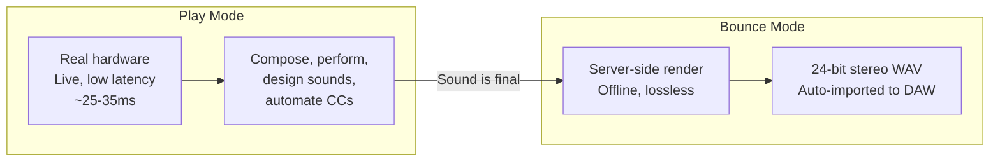
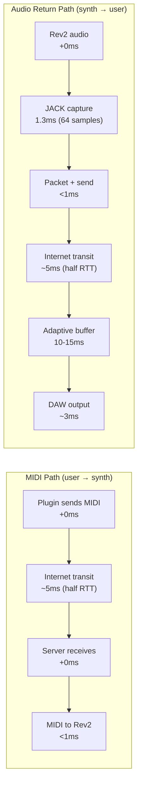
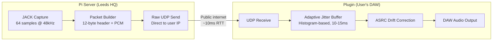
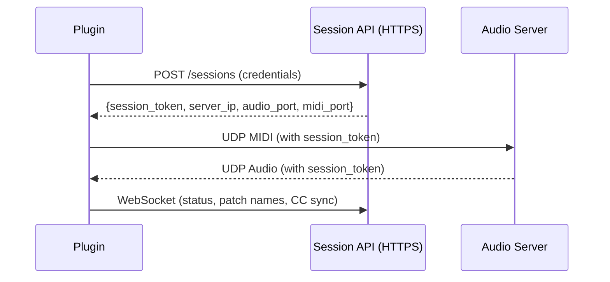
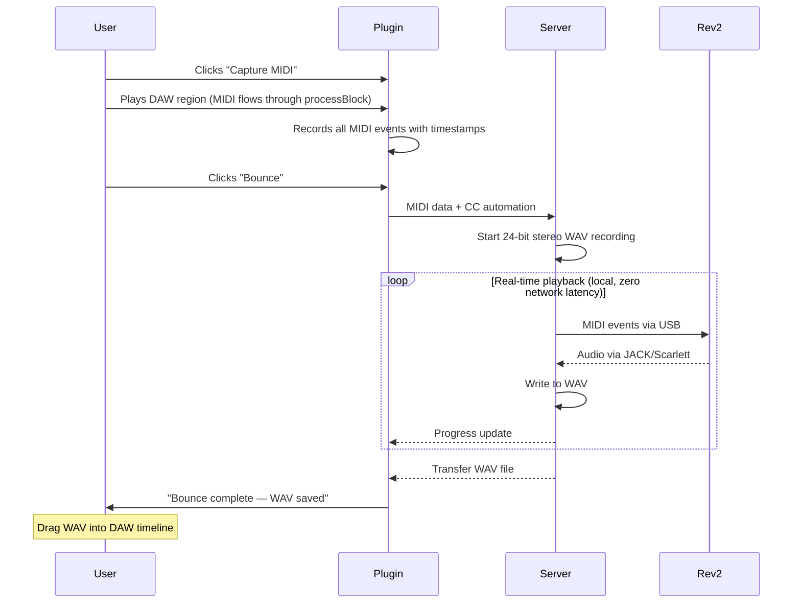

# Revised Product Strategy: Live Analogue + Bounce

**Status:** Active — this is the current strategy
**Date:** 2026-04-03
**Supersedes:**
- `20260403-1514-three-mode-workflow.md` (three modes → two modes, synth modelling dropped)
- `20260401-2002-audio-streaming-reliability.md` (FEC dropped, adaptive buffer retained)
- `rev2-preview-engine.md` (synth modelling dropped entirely)

## Core Insight

A Raspberry Pi on a leased line in a UK data centre or office gives **5-15ms RTT** to most UK users. With an adaptive jitter buffer and raw UDP (no WireGuard on the audio path), total MIDI-to-audio latency can be **25-35ms**. That's a live playable instrument — comparable to a guitarist playing through a USB audio interface.

**This means synth modelling is unnecessary.** The real hardware IS the product. The latency is low enough to play live. No compromise, no "close enough" emulation.

## The Product

Anarack is a remote hardware synth studio. Producers connect from their DAW, play real analogue synths over the internet with near-zero latency, and bounce lossless stereo recordings.

### Two Modes



**Play** — real hardware, live audio, lowest achievable latency. This is where you write parts, design sounds, perform, automate. It feels like the synth is in your room.

**Bounce** — offline render. Server plays your MIDI locally into the synth, captures lossless 24-bit stereo, sends the WAV back. Perfectly timed, studio quality. For final mixdown.

No synth modelling. No "preview" mode. No compromise. Just the real thing.

## Why This Works Now (And Didn't Before)

The original architecture used WireGuard (boringtun) through a VPS relay for NAT traversal. This added ~150-200ms of latency:

| Factor | Old (home Pi + VPS relay) | New (office/colo + leased line) |
|--------|--------------------------|--------------------------------|
| NAT traversal | VPS relay needed (no public IP) | Direct connection (static IP) |
| Encryption | boringtun userspace (+50ms jitter) | Raw UDP for audio (0ms overhead) |
| Network path | Plugin → VPS → Pi (2 hops) | Plugin → server (1 hop) |
| Network stability | Home broadband (variable jitter) | Leased line (stable, low jitter) |
| Jitter buffer | Fixed 300ms (conservative) | Adaptive 10-15ms (histogram-based) |
| **Total latency** | **~350-400ms** | **~25-35ms** |

The data centre deployment eliminates every source of unnecessary latency. What remains is physics: speed of light + JACK capture + a small adaptive buffer.

## Latency Budget

Target: **sub-35ms** for UK users connecting to Leeds HQ.



| Step | Latency | Notes |
|------|---------|-------|
| MIDI: plugin → server | ~5ms | Half RTT on leased line |
| MIDI: server → Rev2 | <1ms | Local USB MIDI |
| Rev2 produces sound | 0ms | Analogue, instant |
| JACK captures audio | 1.3ms | 64 samples @ 48kHz |
| Audio: server → plugin | ~5ms | Half RTT |
| Adaptive jitter buffer | 10-15ms | Histogram-based, targets P95 jitter |
| DAW output buffer | ~3ms | 128 samples @ 44.1kHz |
| **Total** | **~25-30ms** | |

For comparison:
- Acoustic piano: ~3ms (hammer to ear)
- Guitar through USB interface: ~10-20ms
- Guitarist 10m from amp: ~30ms
- **Anarack UK user: ~25-35ms** ← right in the "feels live" range

## Streaming Architecture (Revised)

### Audio Path: Raw UDP, No Encryption



**No WireGuard on the audio path.** Audio is int16/int24 PCM — there's nothing sensitive in it. A leaked packet is a millisecond of synth audio. Not worth adding 50ms of jitter to protect.

**Authentication:** Each session gets a random token. Plugin includes the token in every UDP packet header. Server drops packets with invalid tokens. This prevents unauthorized access without any encryption overhead.

**Control channel stays secure:** Session management, login, billing, MIDI — all over HTTPS/WSS. Only the high-frequency audio stream is raw UDP.

### Control Path: HTTPS + WebSocket



### Adaptive Jitter Buffer

Replace the fixed buffer with a NetEQ-style histogram approach:

1. **Track inter-arrival jitter** — measure the variation in packet arrival times
2. **Maintain a histogram** — 64 bins, 1ms each, with a forgetting factor
3. **Target the 95th percentile** — buffer just enough to absorb 95% of jitter
4. **Resize via ASRC** — adjust the resampling ratio to smoothly grow/shrink the buffer. No clicks, no discontinuities.

On a leased line with ~2ms jitter, the buffer naturally settles to 10-15ms.
On home broadband with ~10ms jitter, it settles to 20-30ms.
On mobile/poor connections, it grows to whatever's needed.

**The user sees their actual latency** in the plugin UI. No hiding, no guessing. "Round trip: 28ms" — they know exactly what they're getting.

### JACK at 64 Samples

Reduce the Pi's JACK buffer from 128 to 64 samples:
- 128 samples @ 48kHz = 2.67ms capture latency
- 64 samples @ 48kHz = 1.33ms capture latency
- Saves 1.3ms — meaningful when every ms counts
- Pi 5 handles this easily on a dedicated audio machine

## Bounce Workflow

Unchanged from the previous plan. Server-side offline render.



**MIDI capture via processBlock** — the plugin is already on the track receiving MIDI. User clicks Capture, plays the region, plugin records everything. No need to export .mid files.

**Tail recording** — configurable extra seconds after the last MIDI event to capture reverb/delay tails.

**WAV delivery** — transferred over the network connection. A 5-minute 24-bit stereo WAV is ~50MB. On a fast connection that's seconds. On slower connections, show a progress bar.

## Deployment Roadmap

### Rig #1: Leeds HQ (Now → Launch)

```
┌─────────────────────────────────────┐
│  Leeds Office / Warehouse           │
│                                     │
│  100Mbps symmetric leased line      │
│  Static IP, low jitter              │
│                                     │
│  ┌─── Rack ────────────────────┐    │
│  │  Pi 5                       │    │
│  │  Scarlett 18i20             │    │
│  │  Prophet Rev2               │    │
│  │  [Future: Moog, Korg, etc]  │    │
│  └─────────────────────────────┘    │
│                                     │
│  Also: desk, monitors, camera       │
│  (content creation, marketing)      │
│                                     │
│  You maintain everything on-site    │
└─────────────────────────────────────┘
```

- **Cost:** ~£200-300/month leased line + office rent
- **Coverage:** Sub-35ms to most of UK. 40-50ms to London (still playable).
- **Synths:** Start with Rev2. Add more as revenue allows.
- **Content:** Studio space for YouTube demos, walkthroughs, marketing material. "This is the room your synth signal comes from."

### Rig #2: Berlin (After UK Traction)

- EU market, electronic music capital
- You're there regularly — can set up and maintain
- Quarter rack colo or small studio space
- Opens: Germany, Netherlands, Scandinavia, Eastern Europe
- ~5-10ms RTT to most of central/western Europe

### Rig #3-4: US East + West (Revenue Supports It)

- NYC data centre: covers east coast producers
- LA data centre: covers west coast producers
- Quarter rack colo: ~$200-400/month each
- ~5-10ms RTT within region
- Need local engineer or reliable remote hands service

### Coverage Map (at scale)

```
Leeds ──────── UK + Ireland (sub-35ms)
Berlin ─────── EU / Central Europe (sub-30ms)
NYC ────────── US East Coast (sub-30ms)
LA ─────────── US West Coast (sub-30ms)
```

Four rigs covering the majority of the western music production market. Each additional synth per rig is ~£1,000-2,000 hardware cost, no additional engineering.

## Engineering Priorities (In Order)

### Priority 1: Adaptive Jitter Buffer
**The single most impactful change.** Turns 80ms fixed buffer into 10-15ms adaptive on stable connections. Test on LAN first, then over the internet.

- Implement JitterEstimator (histogram-based)
- Integrate with ASRC target fill level
- Measure and display actual latency in UI

### Priority 2: Raw UDP Audio Path
**Eliminate WireGuard from the audio stream.** Keep it for fallback/legacy but make raw UDP the primary path for when the server has a public IP.

- Session token authentication in packet headers
- Server validates tokens, drops invalid packets
- Plugin detects whether server is directly reachable vs needs WireGuard

### Priority 3: JACK 64-Sample Buffer
**Quick win, 1.3ms improvement.**

- Test JACK at 64 samples on Pi 5 with Scarlett
- Verify no xruns under load
- Update JACK startup config

### Priority 4: Bounce Engine
**Server-side MIDI playback + lossless WAV capture.**

- MIDI capture in plugin processBlock
- Server bounce endpoint: parse MIDI, play locally, record WAV
- WAV transfer back to plugin
- Bounce UI: capture button, bounce button, progress bar

### Priority 5: Port Forwarding / Public IP Setup
**Make the Pi reachable from the internet without WireGuard.**

- Static IP or DDNS on current broadband (for testing)
- Port forward UDP audio + MIDI ports
- Connection test: plugin → public IP → Pi

### Priority 6: Multi-Synth Support
**Synth definition system — JSON files drive UI + MIDI mapping.**

- One definition per synth
- Auto-generated UI from definition
- Add synths without code changes

## Revenue Model

**Target: £10k/month within 1 year.**

Subscription-based access to the synth studio:

| Tier | Price | Access |
|------|-------|--------|
| Explorer | £15/month | 2 hours/week, 1 synth |
| Producer | £30/month | 10 hours/week, all synths |
| Studio | £60/month | Unlimited, priority access, offline bounce queue |

At £30/month average:
- 100 subscribers = £3,000/month
- 200 subscribers = £6,000/month
- **334 subscribers = £10,000/month**

334 paying producers in the UK is achievable if the product is genuinely good. There are ~50,000 active music producers in the UK (based on DAW license estimates). You need 0.7% of them.

**Cost structure at £10k/month:**
- Office + leased line: ~£800/month
- Synth depreciation: ~£200/month (spreading hardware cost over 2 years)
- Software/services: ~£100/month
- **Profit: ~£8,900/month** before tax

The margins are excellent because the hardware cost is fixed and shared across all subscribers.

## What We're NOT Building

- ❌ Synth modelling / VST engine — the real hardware is the product
- ❌ Sample-based preview — real-time is fast enough
- ❌ Mobile app — DAW plugin only (producers work in DAWs)
- ❌ Preset marketplace — personal presets only for v1
- ❌ Multi-synth layering — one synth per session for v1
- ❌ Auto WAV placement on DAW timeline — user drags the file in for v1

## Key Risks

| Risk | Impact | Mitigation |
|------|--------|------------|
| Adaptive buffer can't get below 30ms on real internet | High — product feels sluggish | Test on current broadband first. If LAN can't get below 20ms, the problem is in the code not the network. |
| Leased line latency disappoints | High — investment wasted | Test over broadband first with port forwarding. Measure real RTT/jitter before committing to a lease. |
| boringtun hard to remove from audio path | Medium — blocks latency improvement | Raw UDP already works (LAN mode). Just need to add token auth and make it work over public internet. |
| Concurrent users contend for the same synth | Medium — scheduling problem | Queue system + booking. One user per synth at a time. Show availability in plugin. |
| Hardware failure (synth, Pi, Scarlett) | Medium — downtime | Spare Pi + Scarlett on hand. Synth failure needs repair — budget for backup units as revenue grows. |
| 334 subscribers is ambitious for year 1 | Medium — revenue target missed | Start with lower pricing to build user base. Even 100 subs at £30 = £3k/month, enough to sustain part-time. |

## Validation Steps (Before Major Investment)

Before committing to a leased line and office, validate the latency thesis:

1. **Implement adaptive buffer on LAN** — prove we can get to 15-20ms buffer
2. **Port forward and test over broadband** — measure real RTT and jitter to friends in different UK cities
3. **Test from a coffee shop** — real-world internet, different ISP, different routing
4. **If sub-40ms is achievable on broadband** → the leased line will only be better. Commit to the office.
5. **If sub-40ms is NOT achievable** → investigate why. Is it the buffer? The network? The code? Fix before investing.
