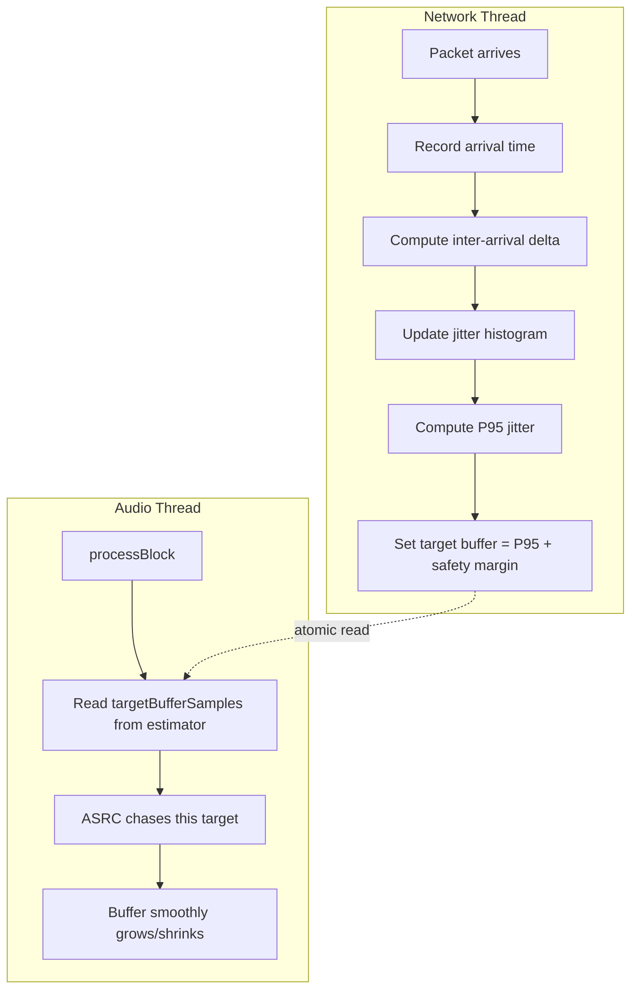
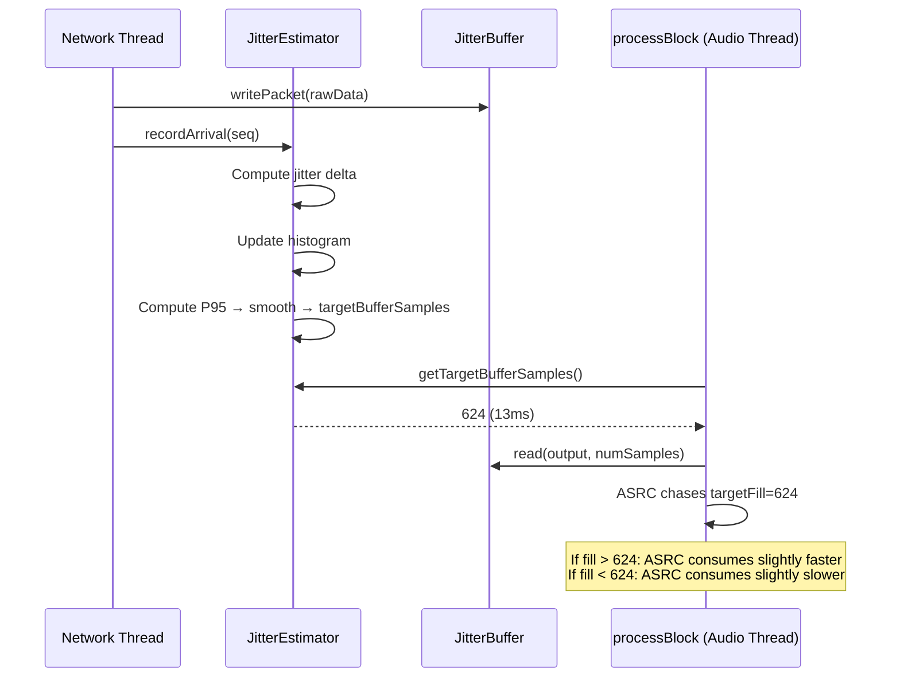

# Adaptive Jitter Buffer Implementation

**Status:** Ready to implement
**Date:** 2026-04-03
**Goal:** Replace the fixed 50% prebuffer with a histogram-based adaptive buffer that targets the 95th percentile of observed jitter. On a stable LAN, this should bring the buffer from 80ms down to 10-20ms.

## Why This Is Priority #1

The entire product strategy rests on achieving sub-35ms total latency. The jitter buffer is the single biggest contributor to latency — currently 80ms minimum on LAN, 300ms on WireGuard. Every other latency source (JACK capture, network transit, DAW output) is already small and hard to shrink further. The buffer is where the 10x improvement comes from.

## Current State

```
JitterBuffer::configure(fixedSizeSamples, sampleRate)
    bufferSize = fixedSizeSamples          ← set once at connection, never changes
    prebufferTarget = fixedSizeSamples / 2 ← fixed 50% fill before playback starts

processBlock:
    targetFill = bufferSize / 2            ← ASRC chases this fixed target
    ASRC accumulates drift, drops/dups ±1 sample to maintain fill level
```

The buffer size is chosen by the user (dropdown: 80ms, 150ms, 200ms, 300ms) and never adapts. Even on a perfect LAN with zero jitter, an 80ms buffer means 40ms of latency from the buffer alone (50% fill target).

## Design

### New Component: JitterEstimator

A lightweight class that measures inter-arrival jitter and computes an adaptive buffer target.



### How Inter-Arrival Jitter Works

We don't need clock synchronisation. We measure the **variation** in packet spacing:

```
Expected: packets arrive every 2.667ms (128 samples / 48000 Hz)

Packet 1 arrives at t=0.000ms      → delta = 0.000ms   → jitter = 0ms
Packet 2 arrives at t=2.700ms      → delta = 2.700ms   → jitter = +0.03ms
Packet 3 arrives at t=5.300ms      → delta = 2.600ms   → jitter = -0.07ms
Packet 4 arrives at t=8.500ms      → delta = 3.200ms   → jitter = +0.53ms  ← small spike
Packet 5 arrives at t=11.100ms     → delta = 2.600ms   → jitter = -0.07ms
...
```

Jitter = `actual_delta - expected_delta`. On a perfect network it's always 0. WiFi adds ±1-5ms. 4G adds ±10-30ms. The histogram captures the distribution.

### Histogram Design

```
64 bins, 0.5ms each → covers 0-32ms of jitter
(32ms covers WiFi and decent broadband; truly bad connections will saturate the last bin)

Index:  [0]   [1]   [2]   [3]   ... [63]
Range: 0.0ms 0.5ms 1.0ms 1.5ms ... 31.5ms

Each bin holds a weighted count (float).
On each packet: multiply all bins by forgetting factor, then increment the appropriate bin.
```

**Forgetting factor:** 0.999 per packet. At 375 packets/sec, half-life = ~1.8 seconds. Recent conditions dominate but brief spikes don't cause violent swings.

**P95 computation:** Walk bins from 0 upward, accumulating weight. The bin where cumulative weight reaches 95% of total is the P95 jitter.

**Target buffer:** `P95_jitter_samples + safety_margin_samples`

- Safety margin: 2 packets = 256 samples = 5.3ms
- Minimum floor: 4 packets = 512 samples = 10.7ms (never go below this)
- Maximum ceiling: user's configured buffer size (so adaptive never exceeds what they set)

### Integration With ASRC

The adaptive buffer doesn't resize the ring buffer or add/remove samples. It changes the **ASRC target fill level**:

```cpp
// Current (fixed):
int targetFill = jitterBuffer.getFixedLatencySamples() / 2;

// New (adaptive):
int targetFill = jitterEstimator.getTargetBufferSamples();
```

The existing ASRC already chases `targetFill` by accumulating drift and applying ±1 sample corrections. When the target decreases (network improved), ASRC speeds up consumption → buffer shrinks. When the target increases (jitter spike), ASRC slows consumption → buffer grows. Smooth, no clicks.

**Rate limiting target changes:** The target should change gradually, not jump. Apply a low-pass filter to the raw P95 value before exposing it as the target:

```cpp
smoothedTarget = smoothedTarget * 0.998 + rawTarget * 0.002;
```

This gives a ~1.3 second time constant at 375 packets/sec. Fast enough to react to sustained network changes, slow enough to avoid oscillation from momentary spikes.

### Prebuffer Strategy

Current: wait for 50% fill of the entire buffer. On 80ms buffer = wait for 40ms of data.

New: wait for the adaptive target to be reached. On a stable LAN where P95 jitter is 2ms, target might be ~13ms (2ms P95 + 5ms safety + 6ms minimum). Prebuffer fills in ~13ms instead of 40ms. Faster connection, lower latency.

During initial prebuffer (first connection), there's no jitter history yet. Start with a conservative default (e.g., 30ms = 1440 samples) and let it adapt downward as jitter measurements come in.

## Implementation

### New File: `plugin/src/JitterEstimator.h`

```
class JitterEstimator
{
public:
    // Called from network receive thread on every audio packet
    void recordArrival(uint32_t seq);

    // Called from audio thread — returns current adaptive target in samples
    int getTargetBufferSamples() const;

    // Stats for UI
    float getP95JitterMs() const;
    float getCurrentTargetMs() const;

private:
    // Timing
    double lastArrivalMs = 0.0;
    uint32_t lastSeq = 0;
    bool firstPacket = true;
    static constexpr double EXPECTED_INTERVAL_MS = 128.0 / 48.0; // 2.667ms

    // Histogram: 64 bins, 0.5ms each, covers 0-32ms
    static constexpr int NUM_BINS = 64;
    static constexpr float BIN_WIDTH_MS = 0.5f;
    float histogram[NUM_BINS] {};
    static constexpr float FORGET_FACTOR = 0.999f;

    // Output (atomic for cross-thread safety)
    std::atomic<int> targetBufferSamples { 1440 };  // default ~30ms
    std::atomic<float> p95JitterMs { 0.0f };

    // Smoothing
    float smoothedTargetSamples = 1440.0f;

    // Config
    static constexpr int SAFETY_MARGIN_SAMPLES = 256;  // 2 packets
    static constexpr int MIN_TARGET_SAMPLES = 512;      // 4 packets (~10.7ms)
    int maxTargetSamples = 24000;  // user's buffer size (set from outside)
};
```

### Changes to NetworkTransport

In the receive loop, after writing the packet to JitterBuffer:

```cpp
// After: jitterBuffer.writePacket(packetBuf, bytesRead);
jitterEstimator.recordArrival(seq);
```

Need to pass a reference to the JitterEstimator into NetworkTransport (same pattern as JitterBuffer).

### Changes to PluginProcessor

```cpp
// In processBlock, replace:
int targetFill = jitterBuffer.getFixedLatencySamples() / 2;

// With:
int targetFill = jitterEstimator.getTargetBufferSamples();
```

### Changes to JitterBuffer

The ring buffer size still needs to be large enough to hold the maximum possible buffer. Configure it at the user's max setting (e.g., 300ms) but the ASRC targets a much smaller fill level. The extra ring buffer space is just headroom — it costs memory but not latency.

The prebuffer target changes from `fixedSizeSamples / 2` to reading from the estimator:

```cpp
// In writePacket, replace:
if (filled >= prebufferTarget)
    prebuffering.store(false, ...);

// With:
if (filled >= jitterEstimator.getTargetBufferSamples())
    prebuffering.store(false, ...);
```

### Changes to UI

Display the adaptive buffer stats in the diagnostics panel:

- **Jitter P95:** e.g., "2.1ms" — shows network quality
- **Buffer target:** e.g., "13ms" — shows what the adaptive algorithm is targeting
- **Actual fill:** e.g., "14ms" — shows current buffer fill
- **Total latency:** e.g., "28ms" — RTT + buffer target (what the user actually experiences)

This replaces guesswork with real numbers. The user can see exactly what their connection quality gives them.

## Data Flow



## Files to Create/Modify

| File | Change | Risk |
|------|--------|------|
| `plugin/src/JitterEstimator.h` | **New** — histogram, P95 computation, target output | Low — self-contained, no existing code touched |
| `plugin/src/NetworkTransport.h` | Add `JitterEstimator&` member, pass through constructor | Low — same pattern as JitterBuffer |
| `plugin/src/NetworkTransport.cpp` | Call `jitterEstimator.recordArrival()` in receive loop | Low — one line addition |
| `plugin/src/PluginProcessor.h` | Add `JitterEstimator jitterEstimator` member | Low |
| `plugin/src/PluginProcessor.cpp` | Use `jitterEstimator.getTargetBufferSamples()` for ASRC target and prebuffer | Medium — changes ASRC behavior |
| `plugin/src/PluginEditor.cpp` | Pass jitter/buffer stats to WebView | Low |
| `plugin/ui/rev2-panel.html` | Display adaptive buffer stats | Low |

## Testing Plan

### Test 1: LAN Raw UDP (Most Important)

Current baseline: 80ms buffer minimum.

1. Connect on LAN (raw UDP, no WireGuard)
2. Observe JitterEstimator converge: P95 jitter should be ~1-3ms on a wired LAN, ~3-8ms on WiFi
3. Buffer target should settle to ~12-18ms (P95 + safety + minimum)
4. Play sustained Rev2 pad — listen for clicks/gaps
5. Play fast staccato notes — check for timing feel

**Pass criteria:** Stable audio at <20ms buffer on wired LAN. No clicks in a 5-minute session.

### Test 2: LAN WiFi

Same as above but on WiFi. Jitter will be higher (5-15ms typical). Buffer target should settle to 20-30ms. Still a major improvement over 80ms.

### Test 3: WireGuard P2P (Same LAN)

Current baseline: 200ms buffer.

Connect via WireGuard. boringtun adds jitter (~50ms spikes). Buffer target should settle to whatever the P95 jitter requires — probably 60-80ms. Still better than 200ms.

### Test 4: Jitter Spike Recovery

While playing audio on LAN:
1. Start a large file download on the same network (floods the connection)
2. Observe: buffer target should grow within 2-3 seconds
3. Stop the download
4. Observe: buffer target should shrink back within 5-10 seconds
5. No audio glitches during the transition

### Test 5: Reconnection

1. Disconnect and reconnect
2. Prebuffer should fill to the default target (~30ms) quickly
3. Target should adapt downward within a few seconds as jitter measurements come in

## Risks and Mitigations

| Risk | Mitigation |
|------|------------|
| Histogram takes too long to converge on startup | Start with conservative 30ms default. User hears audio quickly, latency improves over 2-3 seconds as measurements come in |
| P95 target oscillates → ASRC oscillates → audible pitch wobble | Smooth the target with 1.3s time constant. ASRC already has its own 5s time constant. Double smoothing prevents oscillation |
| Jitter spike causes brief underrun before buffer grows | The ASRC can only grow the buffer as fast as it can slow consumption (~7 corrections/sec). A sudden 20ms jitter spike needs ~3 seconds to fully absorb. PLC covers the gap during transition |
| Timer resolution too low for sub-ms jitter measurement | Use `std::chrono::high_resolution_clock` or `juce::Time::getHighResolutionTicks()`. Both give sub-microsecond resolution on macOS |
| Sequence gaps (packet loss) confuse arrival time measurement | Skip measurement when `seq != lastSeq + 1`. Only measure consecutive packets. Lost packets don't contribute to jitter histogram |
| Very first packets have no history → bad initial measurement | `firstPacket` flag, skip first measurement. Need at least 2 consecutive packets to compute a delta |

## Implementation Order

1. **JitterEstimator.h** — write the class, test histogram/P95 logic with hardcoded values
2. **Wire into NetworkTransport** — call `recordArrival()` on each packet
3. **Wire into PluginProcessor** — use adaptive target for ASRC
4. **Wire into JitterBuffer** — use adaptive target for prebuffer
5. **UI stats** — display P95, target, fill, latency in diagnostics panel
6. **Test on LAN** — prove it works
7. **Test on WireGuard** — verify it adapts to higher jitter
