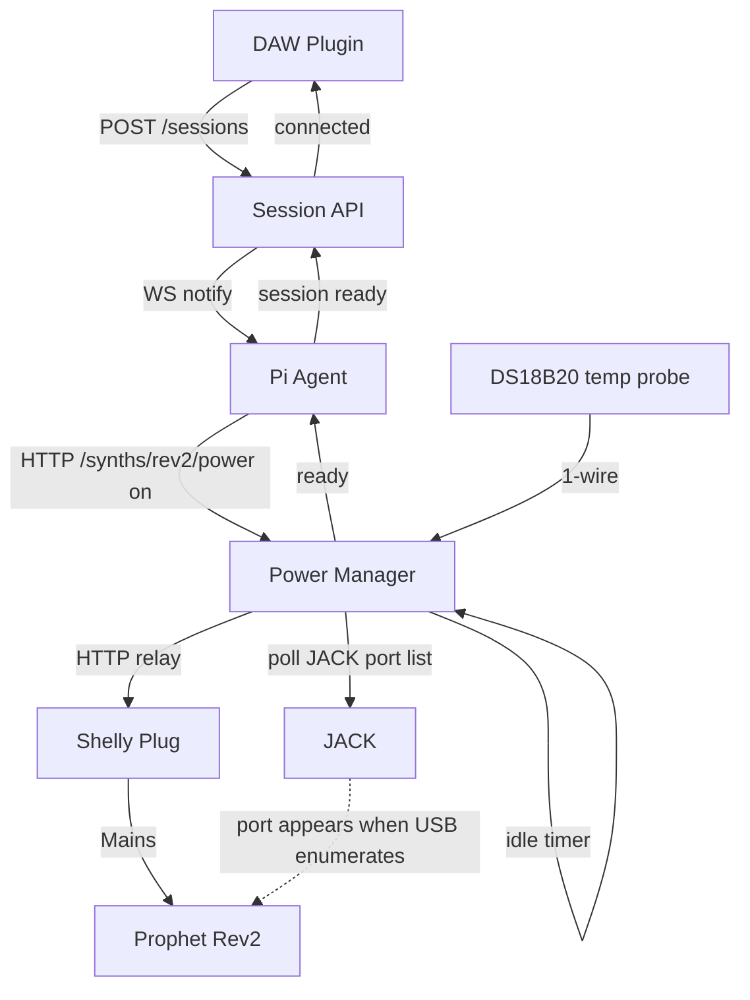
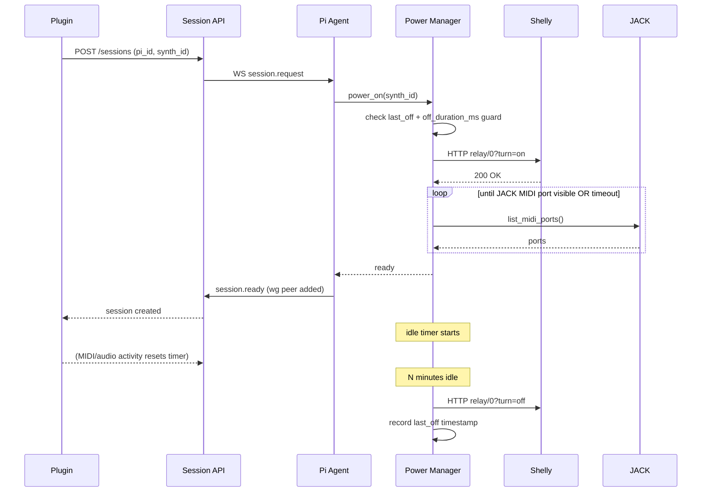

# Remote Power Control for Synths / Racks

**Status:** Draft
**Owner:** Danny
**Created:** 2026-04-07

## Problem

A Pi can live 24/7, but analogue gear (Rev2 today, tube gear and larger racks later) shouldn't. We need a way for Anarack to power synths on before a session and off after, without a human being in the room. This has to be invisible to the producer using the plugin, safe for the hardware, and safe enough to put on a customer site without a liability headache.

## Goals

- Plugin user loads Anarack → synth wakes up → audio flows, no manual steps.
- Idle synths power down automatically to save power and extend component life.
- Per-synth configuration for boot delays, shutdown guards, and power ordering.
- Safe story for thermal runaway, tube cooldowns, and patch-memory corruption.
- Pi itself is never power-cycled remotely (always-on).

## Non-Goals

- Powering the Pi remotely (out of scope — Pi stays on).
- Cloud-dependent smart plugs. Local control only.
- Replacing physical safety (breakers, fuses, smoke alarms) — this augments, never substitutes.

## Architecture Overview



### Session-aware power flow



## Hardware

- **Shelly Plug S** (or Shelly 1 in a fused enclosure for racks) — local HTTP API, no cloud.
- **DS18B20** 1-wire temp probe per rack (Phase 3).
- UL/CE rated only. No AliExpress relays touching mains on customer sites.
- Phase 3: consider a mechanical timer as a hard kill fallback.

## Data Model

Extend synth definition JSON (`synths/rev2.json`, etc.) with a `power` block:

```json
{
  "id": "rev2",
  "power": {
    "controller": "shelly",
    "address": "http://shelly-rev2.local",
    "relay": 0,
    "boot_delay_ms": 8000,
    "boot_timeout_ms": 20000,
    "off_duration_ms": 30000,
    "boot_order": 2,
    "idle_off_ms": 900000,
    "ready_check": "jack_port",
    "jack_port_match": "Prophet Rev2"
  }
}
```

## Implementation Phases

---

### Phase 1 — Manual toggle (weekend-sized)

Goal: one Shelly, one button in the plugin UI, Rev2 turns on and off on demand.

1. **Procure hardware.** One Shelly Plug S. Wire Rev2 through it. Give it a fixed hostname on the studio LAN (`shelly-rev2.local`).
2. **Power Manager module** — new file `server/power_manager.py`.
   - Class `PowerManager` with `power_on(synth_id)`, `power_off(synth_id)`, `status(synth_id)`.
   - Shelly driver: simple `aiohttp` GET to `/relay/0?turn=on|off`, parse JSON response.
   - In-memory state: `{synth_id: {state, last_on, last_off}}`.
   - Enforce `off_duration_ms` guard before re-powering.
3. **Synth definitions** — add `power` block to the Rev2 JSON. Load on Pi Agent startup.
4. **Pi Agent HTTP routes.**
   - `POST /synths/{id}/power` body `{"state": "on"|"off"}`.
   - `GET /synths/{id}/power` returns current state + last transition.
5. **Boot confirmation — fixed delay only** in Phase 1. Sleep `boot_delay_ms` after Shelly returns OK. Good enough for a manual button.
6. **Plugin UI** — small power button on the Rev2 panel header. Yellow while transitioning, green when on, grey when off. Calls Pi Agent directly over existing control channel.
7. **Changelog + version bump.** New build number. Note the hardware dependency.

**Acceptance:** Plugin button toggles Rev2 power. Rev2 boots, plugin reconnects, audio flows. Turning off ends the session cleanly.

---

### Phase 2 — Session-aware auto power

Goal: plugin load = synth wakes, idle = synth sleeps. Producer never thinks about it.

1. **JACK port polling** for boot confirmation.
   - New helper `jack_port_ready(match_string, timeout_ms)` in `power_manager.py`.
   - Polls JACK client/port list every 250ms. Returns true when a MIDI port whose name contains `match_string` appears.
   - Fall back to fixed delay if JACK is unavailable.
2. **Session API integration.**
   - On `POST /sessions`, Session API asks Pi Agent `ensure_synth_ready(synth_id)` before adding WG peer.
   - Pi Agent calls `PowerManager.power_on` if state != on, awaits ready, then provisions WG peer and returns.
3. **Idle timer.**
   - Pi Agent tracks last MIDI + last audio packet timestamp per active synth.
   - Background task: if `now - last_activity > idle_off_ms` AND no active session, call `power_off`.
   - Default 15 min, configurable per synth.
4. **Plugin connection state** — add "waking synth" phase between "connecting" and "connected". UI shows "Powering on Rev2…" with progress.
5. **Graceful shutdown guard.**
   - Before powering off, wait 2s after the last MIDI message (avoid cutting power mid-patch-write).
   - For synths with a "save & standby" SysEx in the definition, send it first.
6. **Changelog + version bump.**

**Acceptance:** Close DAW → wait 15 min → Rev2 powers off. Reopen DAW → plugin shows "Powering on Rev2…" → audio flows within ~10s. No manual intervention.

---

### Phase 3 — Rack profiles + safety (for customer sites)

Goal: power sequence a multi-unit rack safely, with thermal + liability safeguards.

1. **Rack profile** — new JSON `racks/{rack_id}.json` listing synths and their `boot_order`. Power Manager honours order on startup, reverse order on shutdown, with configurable inter-step delay.
2. **Temp monitoring.**
   - DS18B20 1-wire probe per rack, read via `/sys/bus/w1/devices/...`.
   - Background task logs temp every 30s, publishes to Session API for dashboards.
   - Hard cutoff: if probe > `max_temp_c`, cut all rack power and raise an alert.
3. **Hardware watchdog.**
   - Second Shelly on a dedicated "safety" circuit that kills the entire rack if the Pi stops heartbeating (Shelly action timer).
   - Document the wiring and test procedure.
4. **Tube gear support.**
   - Enforce long `off_duration_ms` (e.g. 120s) and cooldown timers.
   - Explicitly flag synths that cannot be hot-cycled.
5. **Customer-site readiness.**
   - Review insurance implications with whoever handles Studio Audience Ltd policies.
   - Document the install procedure: which breakers, which sockets, where the watchdog goes.
   - Pre-deployment checklist: UL/CE sticker check, thermal probe placement, watchdog test, manual-kill location.
6. **Changelog + version bump.**

**Acceptance:** Full rack (3+ synths) powers up in sequence on session start, powers down in reverse on idle. Temp probe triggers a fake over-temp event and rack cuts within 5s. Pulling the Pi's ethernet for 60s causes watchdog Shelly to cut rack power.

---

## Open Questions

- Does the Rev2 actually tolerate hot power-cycling long term? Worth a chat with Sequential or a long-running soak test.
- Should idle-off be global ("no sessions for N min") or per-synth ("this synth hasn't been touched")? Per-synth is nicer for racks where one synth is active.
- Where does the Power Manager live? Same process as Pi Agent (simpler) or separate service (cleaner failure isolation)? Start in Pi Agent, split later if needed.
- Shelly firmware upgrades — who manages them on customer sites? Auto-update risk vs stale-firmware risk.

## Risks

- **Fire / thermal** — mitigated by UL/CE hardware, temp probes, watchdog. Still the biggest risk.
- **Patch corruption** — mitigated by shutdown guard + SysEx standby where supported.
- **Insurance** — needs explicit review before any customer deployment. Phase 3 blocker.
- **Shelly offline** — if the plug loses network, Pi Agent can't toggle it. Handle gracefully: session fails with a clear error, don't hang.
- **Boot confirmation false positives** — JACK port can appear before synth is fully ready to receive SysEx. May need a MIDI identity-request handshake as a second gate.

## Related Files (to be created/modified)

- `server/power_manager.py` (new)
- `server/pi_agent.py` (new routes, session integration)
- `server/session_api.py` (ensure_synth_ready hook)
- `synths/rev2.json` (new `power` block)
- `racks/*.json` (new, Phase 3)
- `plugin/ui/rev2-panel.html` (power button + waking state)
- `plugin/src/PluginProcessor.cpp` (connection state machine)
- `CHANGELOG.md` (every phase)
- `plugin/CMakeLists.txt` (version bumps)

## Todo

- [ ] Phase 1: procure Shelly Plug S, wire Rev2
- [ ] Phase 1: `power_manager.py` with Shelly driver
- [ ] Phase 1: `power` block in `synths/rev2.json`
- [ ] Phase 1: Pi Agent `POST/GET /synths/{id}/power` routes
- [ ] Phase 1: plugin UI power button + state
- [ ] Phase 1: changelog + version bump
- [ ] Phase 2: JACK port readiness polling
- [ ] Phase 2: Session API `ensure_synth_ready` hook
- [ ] Phase 2: idle timer + activity tracking
- [ ] Phase 2: plugin "waking synth" connection phase
- [ ] Phase 2: shutdown guard + optional SysEx standby
- [ ] Phase 2: changelog + version bump
- [ ] Phase 3: rack profile JSON + sequenced power
- [ ] Phase 3: DS18B20 temp monitoring + hard cutoff
- [ ] Phase 3: hardware watchdog Shelly + heartbeat
- [ ] Phase 3: tube gear cooldown enforcement
- [ ] Phase 3: insurance review + install checklist
- [ ] Phase 3: changelog + version bump
