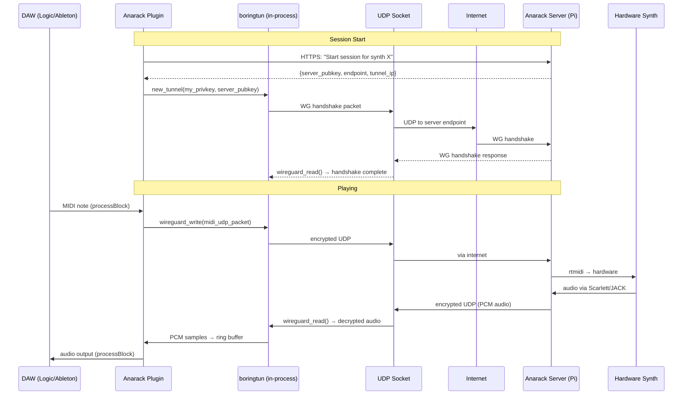
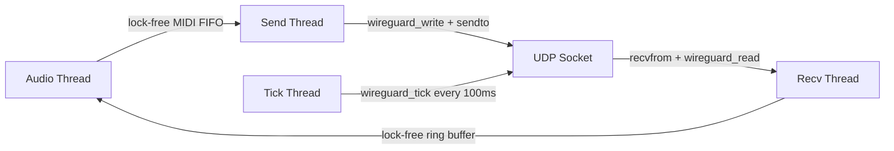

# Plan: Embedded WireGuard (boringtun) in the DAW Plugin

**Status:** Planned
**Date:** 2026-03-29
**Phase:** Production networking — Phase 3 from software strategy

## Context

The prototype proves the concept works on LAN: MIDI goes out, audio comes back, latency is acceptable. The browser demo works over Cloudflare Tunnel. The JUCE AU plugin works in Logic over UDP on the local network.

**Now we need the plugin to work over the internet without the user installing anything.** No Tailscale, no VPN client, no port forwarding. One plugin download, click Play, it connects.

The production answer: **embed Cloudflare's boringtun** (Rust userspace WireGuard) directly into the JUCE plugin as a static library. Each session gets ephemeral keys. The plugin establishes an encrypted UDP tunnel to the server. MIDI and audio flow through it.

## Target Architecture



## Plugin Formats

Both AU (Logic) and VST3 (Ableton) from the **same JUCE codebase**. Already configured — just add `VST3` to the `FORMATS` list in `CMakeLists.txt`:

```cmake
juce_add_plugin(AnarackRev2
    FORMATS AU VST3 Standalone
    ...
)
```

**Shared code:** 100% shared. `PluginProcessor`, `NetworkTransport`, `AudioRingBuffer`, boringtun integration — all identical. JUCE compiles the same source into both formats. The only difference is the wrapper JUCE generates around them.

**Build outputs:**
- `Anarack Rev2.component` → `~/Library/Audio/Plug-Ins/Components/` (Logic)
- `Anarack Rev2.vst3` → `~/Library/Audio/Plug-Ins/VST3/` (Ableton, Bitwig, etc.)
- `Anarack Rev2.app` → Standalone for testing

**Installer:** Single `.pkg` or `.dmg` that installs both AU and VST3 to the correct locations.

## boringtun C API

boringtun exposes a clean C FFI (`wireguard_ffi.h`). It does NOT create virtual network interfaces — it's a pure packet transformation engine. Perfect for embedding in an AU/VST3 plugin (no root, no TUN).

**Key functions:**
| Function | Purpose |
|---|---|
| `new_tunnel(priv, pub, psk, keepalive, index)` | Create tunnel with base64 keys |
| `wireguard_write(tunnel, ip_pkt, len, dst, dst_size)` | Encrypt: app data → WG UDP packet |
| `wireguard_read(tunnel, udp_pkt, len, dst, dst_size)` | Decrypt: WG UDP packet → app data |
| `wireguard_tick(tunnel, dst, dst_size)` | Timer maintenance (~100ms) |
| `wireguard_force_handshake(tunnel, dst, dst_size)` | Initiate handshake |
| `tunnel_free(tunnel)` | Destroy tunnel |
| `x25519_secret_key()` / `x25519_public_key()` | Key generation |

**Flow:** Your app manages a real UDP socket. You wrap your data in a minimal IP/UDP header, pass it to `wireguard_write()` which encrypts it, you send the result over the real socket. Incoming encrypted packets go through `wireguard_read()` to get the plaintext back.

## Implementation Steps

### Step 1: Build boringtun as a static library

Compile boringtun for macOS (universal binary: x86_64 + arm64).

```bash
git clone https://github.com/cloudflare/boringtun.git
cd boringtun/boringtun

# Build for both architectures
cargo build --lib --no-default-features --features ffi-bindings --release \
  --target x86_64-apple-darwin
cargo build --lib --no-default-features --features ffi-bindings --release \
  --target aarch64-apple-darwin

# Create universal binary
lipo -create \
  ../target/x86_64-apple-darwin/release/libboringtun.a \
  ../target/aarch64-apple-darwin/release/libboringtun.a \
  -output libboringtun-universal.a
```

Copy `libboringtun-universal.a` and `wireguard_ffi.h` into `plugin/lib/`.

**Files:**
- `plugin/lib/libboringtun.a` — static library (universal)
- `plugin/lib/wireguard_ffi.h` — C header

Update `CMakeLists.txt` to link it:
```cmake
target_link_libraries(AnarackRev2 PRIVATE
    ${CMAKE_CURRENT_SOURCE_DIR}/lib/libboringtun.a
    ...
)
```

### Step 2: WireGuard tunnel wrapper class

New file: `plugin/src/WgTunnel.h` / `WgTunnel.cpp`

Wraps the boringtun C API in a C++ class:

```
class WgTunnel {
    void* tunnel;              // opaque boringtun tunnel handle
    int udpFd;                 // real UDP socket to server
    std::thread tickThread;    // calls wireguard_tick every 100ms

    bool connect(serverEndpoint, serverPubkey);
    void disconnect();
    int send(data, len);       // wraps in IP/UDP, encrypts, sends
    int recv(buf, maxLen);     // receives, decrypts, strips headers
};
```

**IP/UDP header construction:** Since boringtun operates at the IP layer, we need to wrap our raw MIDI/audio data in minimal IP+UDP headers before calling `wireguard_write()`. This is ~28 bytes of overhead per packet — trivial. We use a fixed tunnel IP pair (e.g., `10.0.0.1` ↔ `10.0.0.2`).

### Step 3: Integrate into NetworkTransport

Replace the current raw UDP send/recv with WgTunnel:

```
Current:  sendto(rawSendFd, midi, ..., serverAddr)     → raw UDP to Pi LAN IP
New:      wgTunnel.send(midi, len)                      → encrypted UDP to server public IP

Current:  recvfrom(rawRecvFd, audioBuf, ...)            → raw UDP from Pi
New:      wgTunnel.recv(audioBuf, maxLen)               → decrypted UDP from server
```

The rest of the pipeline (lock-free ring buffer, resampling, processBlock) stays identical.

**Fallback:** Keep the raw UDP path for LAN use. If the user enters a LAN IP, skip WireGuard. If they enter a public hostname/IP, use WireGuard. Or always use WireGuard — it adds <1ms of crypto overhead.

### Step 4: Server-side WireGuard endpoint

The Pi (or production Mac Mini) needs a WireGuard listener. Two options:

**Option A: Use the kernel WireGuard module** (simpler)
```bash
# On the Pi
sudo apt install wireguard-tools
# Configure wg0 interface with server keypair
```

**Option B: Use boringtun on the server too** (no root needed)
- Run boringtun-cli as a userspace WireGuard endpoint
- Or embed the same FFI into the Python server

For prototype, Option A is simpler. For production (Mac Mini), Option B avoids needing root.

### Step 5: Session API — ephemeral keys

New HTTP endpoint on the server (or a separate session service):

```
POST /api/sessions/start
  → { synth_id: "rev2" }
  ← {
      server_pubkey: "base64...",
      endpoint: "203.0.113.5:51820",
      tunnel_ip: "10.0.0.2",
      server_tunnel_ip: "10.0.0.1",
      midi_port: 5555,
      audio_port: 9999
    }
```

**Flow:**
1. Plugin generates a keypair on launch: `x25519_secret_key()` / `x25519_public_key()`
2. Plugin sends its public key to the session API
3. Server creates a WireGuard peer for this session with the plugin's public key
4. Server returns its public key + endpoint
5. Plugin calls `new_tunnel()` with both keys
6. Handshake happens automatically
7. Session ends → server removes the peer → keys are useless

**Security:** Each session gets unique keys. No persistent VPN. No access to anything except the assigned synth's MIDI and audio ports inside the tunnel.

### Step 6: NAT traversal

WireGuard handles NAT naturally:
- Server has a public IP (or port-forwarded UDP port)
- Plugin always initiates outbound UDP → works through nearly all NATs/firewalls
- WireGuard keepalives (every 25s) keep the NAT mapping alive

**No STUN/TURN needed** — this is simpler than WebRTC.

### Step 7: VST3 build + installer

Add VST3 to the build, create a macOS installer:

```cmake
FORMATS AU VST3 Standalone
```

Installer (`.pkg`) copies:
- `.component` → `~/Library/Audio/Plug-Ins/Components/`
- `.vst3` → `~/Library/Audio/Plug-Ins/VST3/`

Use `pkgbuild` / `productbuild` or a tool like Packages.app.

### Step 8: Connection UI update

Update `PluginEditor` to replace the raw IP field with a proper session flow:

1. **Login:** Email/password or API key
2. **Synth picker:** Show available synths (from API)
3. **Connect:** One click — handles key exchange, tunnel setup, audio routing
4. **Status:** Connected, latency, buffer level, synth name

## Threading Model (unchanged)



The audio thread never touches crypto or sockets. Same lock-free architecture as current.

## File Changes

| File | Change |
|---|---|
| `plugin/CMakeLists.txt` | Add VST3 format, link libboringtun.a |
| `plugin/lib/libboringtun.a` | New: static library (universal binary) |
| `plugin/lib/wireguard_ffi.h` | New: C header from boringtun |
| `plugin/src/WgTunnel.h/.cpp` | New: C++ wrapper around boringtun FFI |
| `plugin/src/NetworkTransport.h/.cpp` | Use WgTunnel instead of raw UDP |
| `plugin/src/PluginEditor.h/.cpp` | Session-based connection UI |
| `server/session_api.py` | New: HTTP endpoint for session/key exchange |
| `server/wg_manager.py` | New: manages WireGuard peers on the server |

## Build Sequence

1. Build boringtun static lib (Rust) → `plugin/lib/`
2. Build JUCE plugin (C++) linking boringtun → AU + VST3 + Standalone
3. Test on LAN first (WireGuard adds ~1ms overhead, should be transparent)
4. Set up server-side WireGuard endpoint on Pi
5. Test over internet (mobile hotspot or remote network)
6. Build installer `.pkg`

## Latency Budget

| Segment | LAN | Internet (UK→UK) |
|---|---|---|
| Plugin → WG encrypt | <0.5ms | <0.5ms |
| Network transit | <1ms | 5-15ms |
| WG decrypt → server | <0.5ms | <0.5ms |
| Server → MIDI → synth | <1ms | <1ms |
| Synth → audio → JACK | 2.7ms (128 samples) | 2.7ms |
| Server → WG encrypt | <0.5ms | <0.5ms |
| Network transit | <1ms | 5-15ms |
| WG decrypt → plugin | <0.5ms | <0.5ms |
| Ring buffer + resample | 20ms | 20ms |
| **Total round-trip** | **~27ms** | **~45-55ms** |

The 20ms ring buffer dominates. Over the internet, network adds ~10-30ms. Total should be under 60ms for UK connections — acceptable for studio recording (not live performance, as stated in the strategy).

## Open Questions

1. **Server hosting:** Pi on home broadband with port forwarding, or a VPS relay? Home broadband has asymmetric latency. A VPS adds a hop but gives a static public IP.
2. **Multi-synth sessions:** One WireGuard tunnel per synth, or one tunnel with multiplexed streams?
3. **Windows/Linux:** boringtun builds for all platforms. VST3 is cross-platform. When do we add Windows support?
4. **Code signing:** AU/VST3 plugins need to be signed and notarized for macOS Gatekeeper. Need an Apple Developer account ($99/yr).
